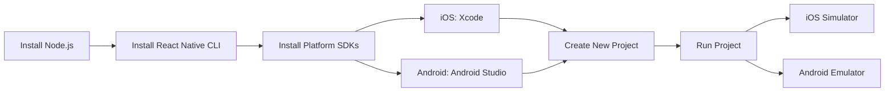
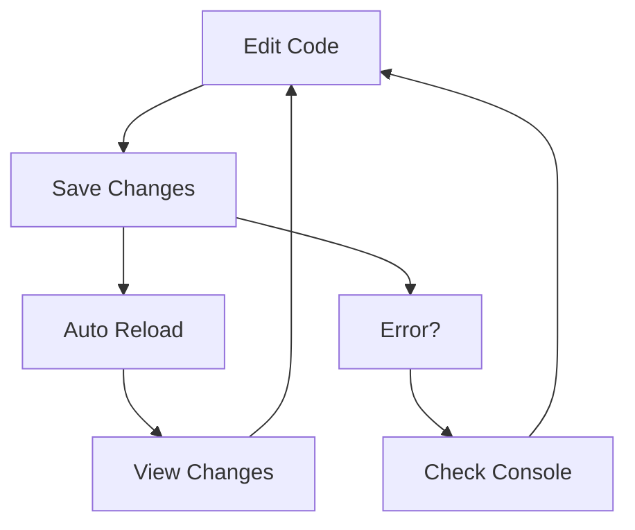

# Session 4: Environment & Core Concepts

## Agenda

1. Recap: React Web vs React Native
2. Setting Up the Development Environment
3. Core Components in React Native
4. Project Structure
5. Live Coding: Your First React Native App
6. Understanding Mobile UI Components
7. Practice: Styling & Layout
8. Next Steps: Building More Complex UIs

---

## 1. Recap: React Web vs React Native

- Review from [Session 3](../../week1/s3/readme.md):
  - We built a web app using React
  - Used HTML elements (`<div>`, `<button>`, etc.)
  - Applied CSS styles directly
- Key Differences in React Native:
  - Uses native components (`<View>`, `<Text>`, etc.)
  - Styles through `StyleSheet` API
  - Platform-specific considerations

---

## 2. Setting Up the Development Environment

### Development Environment Flow



### Required Tools:
- Node.js & npm
- React Native CLI
- Xcode (for iOS)
- Android Studio (for Android)

### Development Workflow



### Initial Setup:
```bash
# As of 2025, the recommended way to create a new React Native project is using Expo
# Expo provides a better developer experience and includes TypeScript by default

# Create a new project with Expo
npx create-expo-app@latest IdeaStorm --template blank-typescript

```

**Explanation:**  
The setup process creates a new React Native project with TypeScript configuration, ready for both iOS and Android development.

---

## 3. Core Components in React Native

| Web Component | React Native Component | Purpose                     |
|---------------|----------------------|------------------------------|
| `<div>`       | `<View>`            | Container/layout component    |
| `<p>`         | `<Text>`            | Text display                 |
| `<button>`    | `<TouchableOpacity>`| Interactive elements         |
| `<input>`     | `<TextInput>`       | User input                   |
| ``       | `<Image>`           | Image display                |

**Important Note:**  
All text must be wrapped in `<Text>` components. You can't put text directly in `<View>`.

---

## 4. Project Structure

```
IdeaStorm/
├── .expo/          // Expo-specific cache and configuration
├── assets/         // For images, icons, and fonts
├── node_modules/   // Project dependencies
├── App.tsx         // The root component of your app
├── app.json        // Your app's main configuration file
├── index.ts        // The entry point for the application
├── package.json    // Project dependencies and scripts
└── tsconfig.json   // TypeScript configuration
```

**Key Files:**
- `App.tsx`: This is the root component where you will build your app's UI.
- `app.json`: This file contains configuration for your app, like its name, icon, and splash screen.
- `index.ts`: This is the main entry point that registers your `App` component. You typically won't need to edit this file.
- `package.json`: Manages your project's dependencies (like React, Expo) and scripts (like `npm start`).

---

## 5. Live Coding: Building the IdeaStorm App

Now that our environment is set up and we understand the basic structure, let's build the app step-by-step.

### Step 1: Clean Up `App.tsx`

First, open `App.tsx`. The default template has some boilerplate code. Let's replace it with a simple "Hello World" to start fresh. This ensures we build everything from the ground up.

```tsx
// App.tsx
import React from 'react';
import { View, Text, StyleSheet, SafeAreaView } from 'react-native';

const App = () => {
  return (
    <SafeAreaView style={styles.container}>
      <View style={styles.header}>
        <Text style={styles.headerTitle}>IdeaStorm</Text>
        <Text style={styles.headerSubtitle}>Capture your creative ideas</Text>
      </View>
    </SafeAreaView>
  );
};

const styles = StyleSheet.create({
  container: { flex: 1, backgroundColor: '#f5f5f5' },
  header: { padding: 20, backgroundColor: '#2196F3', alignItems: 'center' },
  headerTitle: { fontSize: 28, fontWeight: 'bold', color: '#fff' },
  headerSubtitle: { fontSize: 16, color: '#fff', opacity: 0.8 },
});

export default App;
```

### Step 2: Add the Input Form

Next, let's add the input fields and a button to capture new ideas. We'll add the JSX for the form below the header.

```tsx
// App.tsx (add inside the return statement)
// ... inside <SafeAreaView>

<View style={styles.inputContainer}>
  <TextInput
    style={styles.input}
    placeholder="Enter idea title"
  />
  <TextInput
    style={[styles.input, styles.descriptionInput]}
    placeholder="Enter idea description"
    multiline
  />
  <TouchableOpacity style={styles.addButton}>
    <Text style={styles.buttonText}>Add Idea</Text>
  </TouchableOpacity>
</View>

// ... also add these new styles to StyleSheet.create()
const styles = StyleSheet.create({
  // ... existing styles
  inputContainer: { padding: 20, backgroundColor: '#fff', elevation: 2, shadowColor: '#000', shadowOffset: { width: 0, height: 2 }, shadowOpacity: 0.1, shadowRadius: 2 },
  input: { backgroundColor: '#f8f9fa', borderRadius: 8, padding: 12, marginBottom: 10, borderWidth: 1, borderColor: '#e9ecef' },
  descriptionInput: { height: 80, textAlignVertical: 'top' },
  addButton: { backgroundColor: '#2196F3', alignItems: 'center', justifyContent: 'center', padding: 12, borderRadius: 8 },
  buttonText: { color: '#fff', fontSize: 16, fontWeight: '600' },
});
```

### Step 3: Add State and Logic

Now, let's make the form functional. We'll use the `useState` hook to manage the input values and the list of ideas.

```tsx
// App.tsx (add at the top of the App component)

// 1. Import useState
import React, { useState } from 'react';

// 2. Define the Idea data structure
interface Idea {
  id: string;
  title: string;
  description: string;
  date: string;
}

// 3. Inside the App component
const App = () => {
  const [ideas, setIdeas] = useState<Idea[]>([]);
  const [newTitle, setNewTitle] = useState('');
  const [newDescription, setNewDescription] = useState('');

  const addIdea = () => {
    if (newTitle.trim() === '') return; // Basic validation
    const newIdea: Idea = {
      id: Date.now().toString(),
      title: newTitle,
      description: newDescription,
      date: new Date().toLocaleDateString(),
    };
    setIdeas([newIdea, ...ideas]);
    setNewTitle('');
    setNewDescription('');
  };

  // ... rest of the component
}

// 4. Hook up the state to the inputs and button
<TextInput
  value={newTitle}
  onChangeText={setNewTitle}
  // ... other props
/>
<TextInput
  value={newDescription}
  onChangeText={setNewDescription}
  // ... other props
/>
<TouchableOpacity onPress={addIdea} style={styles.addButton}>
  {/* ... */}
</TouchableOpacity>
```

### Step 4: Display the List of Ideas

Let's render the ideas using a `FlatList`, which is a performant component for rendering lists.

```tsx
// App.tsx (add inside the return statement, below the inputContainer)

// 1. Import FlatList
import { /*...,*/ FlatList, Alert } from 'react-native';

// 2. Define the renderItem function inside the App component
const renderItem = ({ item }: { item: Idea }) => (
  <View style={styles.ideaCard}>
    <Text style={styles.ideaTitle}>{item.title}</Text>
    <Text style={styles.ideaDescription}>{item.description}</Text>
    <Text style={styles.ideaDate}>{item.date}</Text>
  </View>
);

// 3. Add the FlatList component to your JSX
<FlatList
  data={ideas}
  renderItem={renderItem}
  keyExtractor={item => item.id}
  style={styles.list}
  ListEmptyComponent={<Text style={styles.emptyText}>No ideas yet. Start adding some!</Text>}
/>

// 4. Add the new styles
const styles = StyleSheet.create({
  // ... existing styles
  list: { padding: 20 },
  ideaCard: { backgroundColor: '#fff', padding: 15, borderRadius: 8, marginBottom: 10, elevation: 1 },
  ideaTitle: { fontSize: 18, fontWeight: '600', marginBottom: 5 },
  ideaDescription: { fontSize: 14, color: '#666', marginBottom: 8 },
  ideaDate: { fontSize: 12, color: '#999' },
  emptyText: { textAlign: 'center', marginTop: 20, color: '#999' },
});
```

### Step 5: Create a Reusable `IdeaCard` Component

To keep our code organized, we'll create a reusable component for displaying each idea. First, create a `components` folder in your project root. Then, create a new file inside it named `IdeaCard.tsx` and add the following code. This component will accept props and handle its own styling.

```tsx
// components/IdeaCard.tsx
import React from 'react';
import {
  View, Text, StyleSheet, TouchableOpacity
} from 'react-native';
import { FontAwesome } from '@expo/vector-icons';

// Props for the component, allowing for customization.
interface IdeaCardProps {
  title: string;
  description: string;
  date: string;
  onDelete?: () => void;
}

const IdeaCard: React.FC<IdeaCardProps> = ({ title, description, date, onDelete }) => {
  return (
    <View style={styles.card}>
      <View style={styles.content}>
        <Text style={styles.title}>{title}</Text>
        <Text style={styles.description}>{description}</Text>
        <Text style={styles.date}>{date}</Text>
      </View>
      {/* The delete button is only shown if an onDelete function is provided. */}
      {onDelete && (
        <TouchableOpacity onPress={onDelete} style={styles.deleteButton}>
          <FontAwesome name="trash" size={18} color="#ff4444" />
        </TouchableOpacity>
      )}
    </View>
  );
};

const styles = StyleSheet.create({
  card: { backgroundColor: '#fff', padding: 15, borderRadius: 8, marginBottom: 10, elevation: 1, flexDirection: 'row', alignItems: 'center' },
  content: { flex: 1 },
  title: { fontSize: 18, fontWeight: '600', marginBottom: 5 },
  description: { fontSize: 14, color: '#666', marginBottom: 8 },
  date: { fontSize: 12, color: '#999' },
  deleteButton: { padding: 10, marginLeft: 10 },
});

export default IdeaCard;
```

### Step 6: Integrate `IdeaCard` and Add Delete Functionality

Finally, let's refactor `App.tsx` to use our new `IdeaCard` component and add the logic to delete ideas.

```tsx
// App.tsx (Updated)

// 1. Import the new component
import IdeaCard from './components/IdeaCard';

// ... (rest of the imports and interface definition are the same)

const App = () => {
  // ... (useState hooks are the same)

  // ... (addIdea function is the same)

  // 2. Add the deleteIdea function
  const deleteIdea = (id: string) => {
    Alert.alert(
      'Delete Idea',
      'Are you sure you want to delete this idea?',
      [
        { text: 'Cancel', style: 'cancel' },
        { 
          text: 'Delete', 
          style: 'destructive', 
          onPress: () => {
            setIdeas(ideas.filter(idea => idea.id !== id));
          }
        }
      ]
    );
  };

  // 3. Update the renderItem function to use the IdeaCard component
  const renderItem = ({ item }: { item: Idea }) => (
    <IdeaCard
      title={item.title}
      description={item.description}
      date={item.date}
      onDelete={() => deleteIdea(item.id)}
    />
  );

  // ... (The return statement with the FlatList is the same)

  return (
    <SafeAreaView style={styles.container}>
      {/* ... Header and InputContainer ... */}

      <FlatList
        data={ideas}
        renderItem={renderItem}
        keyExtractor={item => item.id}
        style={styles.list}
        ListEmptyComponent={<Text style={styles.emptyText}>No ideas yet. Start adding some!</Text>}
      />
    </SafeAreaView>
  );
};

// ... (styles are the same)

export default App;
```
  title, description, date, onPress, onDelete
}) => {
  return (
    <TouchableOpacity onPress={onPress} activeOpacity={0.7}>
      <View style={styles.card}>
        <View style={styles.header}>
          <Text style={styles.title}>{title}</Text>
          {/* The delete button is only shown if an onDelete function is provided. */}
          {onDelete && (
            <TouchableOpacity onPress={onDelete}>
              <FontAwesome name="trash" size={18} color="#ff4444" />
            </TouchableOpacity>
          )}
        </View>
        <Text style={styles.description}>{description}</Text>
        <Text style={styles.date}>{date}</Text>
      </View>
    </TouchableOpacity>
  );
};

const styles = StyleSheet.create({
  card: { backgroundColor: 'white', borderRadius: 8, padding: 15, marginBottom: 10, shadowColor: '#000', shadowOffset: { width: 0, height: 1 }, shadowOpacity: 0.2, shadowRadius: 1.41, elevation: 2 },
  header: { flexDirection: 'row', justifyContent: 'space-between', alignItems: 'center', marginBottom: 8 },
  title: { fontSize: 18, fontWeight: '600', color: '#333', flex: 1 },
  description: { fontSize: 14, color: '#666', marginBottom: 8, lineHeight: 20 },
  date: { fontSize: 12, color: '#999' },
});

export default IdeaCard;
```

### Step 6: Update App.tsx to Use the Reusable Component

Now, let's refactor `App.tsx` to use our new `IdeaCard` component. This simplifies our main file and demonstrates how to compose components.

```tsx
// App.tsx (Updated)

// 1. Import the new component
import IdeaCard from './components/IdeaCard';

// ... (rest of the imports and interface definition are the same)

const App = () => {
  // ... (state management is the same)

  // ... (addIdea function is the same)

  // 2. Add a function to handle deleting an idea.
  const deleteIdea = (id: string) => {
    Alert.alert(
      'Delete Idea',
      'Are you sure you want to delete this idea?',
      [
        { text: 'Cancel', style: 'cancel' },
        {
          text: 'Delete',
          style: 'destructive',
          onPress: () => {
            setIdeas(ideas.filter(idea => idea.id !== id));
          },
        },
      ],
    );
  };

  // 3. Update renderItem to use the IdeaCard component.
  const renderItem = ({ item }: { item: Idea }) => (
    <IdeaCard
      title={item.title}
      description={item.description}
      date={item.date}
      onPress={() => Alert.alert('Idea Details', item.description)}
      onDelete={() => deleteIdea(item.id)}
    />
  );

  // 4. The JSX structure remains the same, but FlatList now renders IdeaCard components.
  return (
    <SafeAreaView style={styles.container}>
      {/* ... Header and Input form ... */}
      <FlatList
        data={ideas}
        renderItem={renderItem}
        keyExtractor={item => item.id}
        style={styles.list}
        ListEmptyComponent={
          <Text style={styles.emptyText}>
            No ideas yet. Start adding some!
          </Text>
        }
      />
    </SafeAreaView>
  );
};

// The styles are the same as before, no changes needed here.

export default App;
```

**Key Changes:**
- We now import and use the `IdeaCard` component.
- A `deleteIdea` function has been added to handle removing ideas, complete with a confirmation alert.
- The `renderItem` function is much simpler, as it just passes props to `IdeaCard`.
- The main `App` component is now a container that manages state and passes data down to its children components.

### Step 6: Running the App with Expo

Now that the code is complete, let's run the application using the Expo Go app on your phone or a simulator on your computer.

#### 1. Start the Development Server

In your terminal, at the root of your `IdeaStorm` project, run:

```bash
# Start the Expo development server
npx expo start
```

This will start the Metro bundler and show a QR code in the terminal.

#### 2. Open the App

- **On a physical device**: Install the **Expo Go** app from the App Store or Google Play. Scan the QR code from your terminal with your phone's camera.
- **On a simulator/emulator**: Press `i` in the terminal to open the iOS Simulator, or `a` to open the Android Emulator. (You must have Xcode or Android Studio correctly configured for this to work).

Your `IdeaStorm` app should now be running and ready to test!

#### 2. Platform-specific Setup

**For Mac Users (iOS):**
1. Make sure Xcode is installed and up to date
2. Install iOS dependencies:
```bash
# Navigate to ios directory and install pods
cd ios && pod install && cd ..
```

**For Android (Both Windows & Mac):**
1. Make sure Android Studio is installed
2. Open Android Studio and install any required SDK packages
3. Add the following line at the end of `android/app/build.gradle`:
```gradle
apply from: "../../node_modules/react-native-vector-icons/fonts.gradle"
```

#### 3. Start Metro Bundler
Open a terminal and run:
```bash
# Start the Metro bundler
npx react-native start
```

#### 4. Run the App

**For Mac Users (iOS):**
Open a new terminal and run:
```bash
# Run on iOS simulator
npx react-native run-ios
```

**For Android (Both Windows & Mac):**
1. Open Android Studio
2. Open the `android` folder in your project
3. Start an Android emulator from Android Studio's Device Manager
4. Open a new terminal and run:
```bash
# Run on Android emulator
npx react-native run-android
```

#### Troubleshooting

### Step 6: Running Your Application

**With Expo (easiest method):**
```bash
# Install dependencies
npm install

# Start the Expo development server
npx expo start
```

This will display a QR code that you can scan with the Expo Go app on your iOS or Android device. You can also press 'i' to open in iOS simulator or 'a' to open in Android emulator if they're installed.

**For iOS (Mac only, requires native build):**
```bash
# Generate native code (only needed once)
npx expo prebuild

# Install iOS-specific dependencies
cd ios && pod install && cd ..

# Start the application on iOS simulator
npx expo run:ios
```

**For Android (requires native build):**
```bash
# Generate native code (only needed once)
npx expo prebuild

# Make sure you have an Android emulator running or a device connected
# Start the application on Android
npx expo run:android
```

**Installing Vector Icons with Expo:**
```bash
# Install the vector icons package
npm install @expo/vector-icons

# No additional setup required for Expo projects!
# Vector icons are included in the Expo SDK
```

**Setting up Vector Icons for Android (only if using native build):**
```bash
# After running npx expo prebuild, open android/app/build.gradle and add:
apply from: "../../node_modules/react-native-vector-icons/fonts.gradle"
```

### Step 7: Troubleshooting Common Issues

**For Expo:**
```bash
# If you have dependency issues:
npm install

# If Metro bundler has issues:
npx expo start --clear
```

**For iOS (Mac, only if using native build):**
```bash
# If you get Pod related errors:
cd ios && pod deintegrate && pod install && cd ..

# If you need to clean the build:
cd ios && xcodebuild clean && cd ..
```

**For Android (only if using native build):**
```bash
# If you get build errors:
cd android && ./gradlew clean && cd ..

# If Metro can't connect:
npx expo start --clear
```

**Common Issues Checklist:**
1. Make sure you're in the project root directory
2. Ensure all environment prerequisites are installed
3. For Android, make sure an emulator is running
4. For iOS, make sure Xcode is up to date
5. Check that all dependencies are installed with `npm install`

**Additional Troubleshooting:**
1. If you see errors about missing modules:
   ```bash
   npm install   # Reinstall dependencies
   ```

2. For iOS vector-icons issues:
   - Make sure you've run `pod install`
   - Clean build: `cd ios && xcodebuild clean && cd ..`

3. For Android vector-icons issues:
   - Verify you've added to android/app/build.gradle:
   ```gradle
   apply from: "../../node_modules/react-native-vector-icons/fonts.gradle"
   ```

4. Metro bundler issues:
   ```bash
   # Clear Metro cache
   npx react-native start --reset-cache
   ```

5. If the app crashes immediately:
   - Check the error logs in the terminal
   - Verify that all imports in your code are correct
   - Make sure you've installed all required dependencies

**Explanation:**  
- `SafeAreaView`: Ensures content is visible on all devices
- `TouchableOpacity`: Makes the card clickable with feedback
- `StyleSheet`: Organizes styles efficiently
- Props & TypeScript: Type-safe component props
- Shadow properties: Adds depth to the card
- Vector icons: Professional-looking icons

---

## 6. Understanding Mobile UI Components

### Core Components:
- `<View>`: Container component (like div)
- `<Text>`: Text display
- `<TouchableOpacity>`: Touchable wrapper
- `<TextInput>`: Text input field
- `<Image>`: Image display
- `<ScrollView>`: Scrollable container
- `<FlatList>`: Efficient list rendering

### Example:
```tsx
<View style={styles.container}>
  <Text style={styles.title}>Welcome</Text>
  <TextInput
    style={styles.input}
    placeholder="Enter your name"
  />
  <TouchableOpacity style={styles.button}>
    <Text style={styles.buttonText}>Press Me</Text>
  </TouchableOpacity>
</View>
```

---

## 7. Practice: Styling & Layout

**Goal:** Create a simple profile card using React Native components.

### Requirements:
1. Use `View` and `Text` components
2. Apply proper styling using `StyleSheet`
3. Add an image using `Image` component
4. Make it touchable using `TouchableOpacity`

### Basic Structure:
```tsx
<View style={styles.card}>
  <Image
    style={styles.avatar}
    source={require('./assets/avatar.png')}
  />
  <Text style={styles.name}>John Doe</Text>
  <Text style={styles.role}>Software Developer</Text>
</View>
```

---

## 8. Next Steps

- You now know:
  - Basic React Native setup
  - Core components
  - Styling with `StyleSheet`
  - How to create and run a React Native application
- Next session: Navigation & State Management in React Native

---

## References

- [Session 3: React State & Hooks](../../week1/s3/readme.md)
- [React Native Documentation](https://reactnative.dev/docs/getting-started)
- [React Native Components](https://reactnative.dev/docs/components-and-apis)
- [React Native Style Guide](https://reactnative.dev/docs/style)
- [TypeScript in React Native](https://reactnative.dev/docs/typescript)

---

## Important Notes

### For Expo Projects

After creating the src directory structure, update the App.js or App.tsx file in your project root to import from the src directory:

```javascript
// App.js or App.tsx (in project root)
import App from './src/App';
export default App;
```

And create a new App.tsx file in the src directory with your main application code.

### For React Native CLI Projects (if not using Expo)

If you're using the React Native CLI directly (not recommended for new projects), update the index.js file in your project root:

```javascript
// index.js
import {AppRegistry} from 'react-native';
import App from './src/App'; // Update this line to point to the new location
import {name as appName} from './app.json';

AppRegistry.registerComponent(appName, () => App);
```
