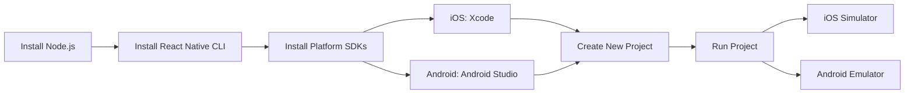
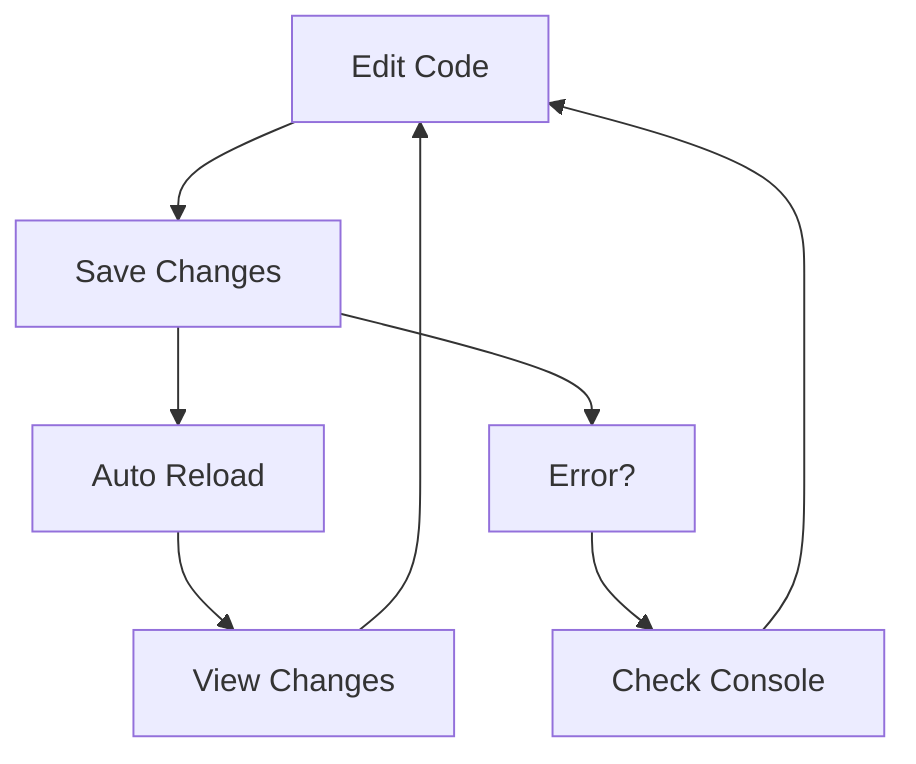

# Session 4: Building a React Native App - IdeaStorm

## Overview

In this session, we'll build IdeaStorm, a mobile app for capturing and managing creative ideas. We'll use React Native with TypeScript and Expo for development.

## Project Goals

1. Create a mobile app with React Native and TypeScript
2. Implement core mobile UI components
3. Handle user input and state management
4. Create reusable components
5. Style components for a polished look

## Prerequisites

- Node.js installed
- VS Code or another code editor
- Basic understanding of React and TypeScript
- Expo Go app installed on your mobile device (optional)

## Getting Started

1. Create a new Expo project with TypeScript:
```bash
npx create-expo-app@latest IdeaStorm-2 --template blank-typescript
cd IdeaStorm-2
```

2. Install dependencies:
```bash
npm install
```

3. Start the development server:
```bash
npx expo start
```

---

## 1. Recap: React Web vs React Native

- Review from [Session 3](../../week1/s3/readme.md):
  - We built a web app using React
  - Used HTML elements (`<div>`, `<button>`, etc.)
  - Applied CSS styles directly
- Key Differences in React Native:
  - Uses native components (`<View>`, `<Text>`, etc.)
  - Styles through `StyleSheet` API
  - Platform-specific considerations

---

## 2. Setting Up the Development Environment

### Development Environment Flow



### Required Tools:
- Node.js & npm
- React Native CLI
- Xcode (for iOS)
- Android Studio (for Android)

### Development Workflow



### Initial Setup:
```bash
# As of 2025, the recommended way to create a new React Native project is using Expo
# Expo provides a better developer experience and includes TypeScript by default

# Create a new project with Expo
npx create-expo-app@latest IdeaStorm --template blank-typescript

```

**Explanation:**  
The setup process creates a new React Native project with TypeScript configuration, ready for both iOS and Android development.

---

## 3. Core Components in React Native

| Web Component | React Native Component | Purpose                     |
|---------------|----------------------|------------------------------|
| `<div>`       | `<View>`            | Container/layout component    |
| `<p>`         | `<Text>`            | Text display                 |
| `<button>`    | `<TouchableOpacity>`| Interactive elements         |
| `<input>`     | `<TextInput>`       | User input                   |
| ``       | `<Image>`           | Image display                |

**Important Note:**  
All text must be wrapped in `<Text>` components. You can't put text directly in `<View>`.

---

## 4. Project Structure

```
IdeaStorm/
├── .expo/          // Expo-specific cache and configuration
├── assets/         // For images, icons, and fonts
├── node_modules/   // Project dependencies
├── App.tsx         // The root component of your app
├── app.json        // Your app's main configuration file
├── index.ts        // The entry point for the application
├── package.json    // Project dependencies and scripts
└── tsconfig.json   // TypeScript configuration
```

**Key Files:**
- `App.tsx`: This is the root component where you will build your app's UI.
- `app.json`: This file contains configuration for your app, like its name, icon, and splash screen.
- `index.ts`: This is the main entry point that registers your `App` component. You typically won't need to edit this file.
- `package.json`: Manages your project's dependencies (like React, Expo) and scripts (like `npm start`).

---

## 5. Live Coding: Building the IdeaStorm App

Now that our environment is set up and we understand the basic structure, let's build the app step-by-step.

### Step 1: Clean Up `App.tsx`

First, open `App.tsx`. The default template has some boilerplate code. Let's replace it with a simple "Hello World" to start fresh. This ensures we build everything from the ground up.

```tsx
import React from 'react';
import { View, Text, StyleSheet, SafeAreaView } from 'react-native';

const App = () => {
  return (
    <SafeAreaView style={styles.container}>
      <View style={styles.header}>
        <Text style={styles.headerTitle}>IdeaStorm</Text>
        <Text style={styles.headerSubtitle}>Capture your creative ideas</Text>
      </View>
    </SafeAreaView>
  );
};

const styles = StyleSheet.create({
  container: { flex: 1, backgroundColor: '#e1a6a6ff' },
  header: { padding: 20, backgroundColor: '#2196F3', alignItems: 'center' },
  headerTitle: { fontSize: 38, fontWeight: 'bold', color: '#fff' },
  headerSubtitle: { fontSize: 20, color: '#fff', opacity: 0.8 },
});

export default App;
```

### Step 2: Add the Input Form

Next, let's add the input fields and a button to capture new ideas. We'll add the JSX for the form below the header.

```tsx
// Import additional components at the top
import { 
  View, 
  Text, 
  StyleSheet, 
  SafeAreaView,
  TextInput,
  TouchableOpacity,
  Alert,
  FlatList 
} from 'react-native';

// ... inside <SafeAreaView>
<View style={styles.inputContainer}>
  <TextInput
    style={styles.input}
    placeholder="Enter idea title"
  />
  <TextInput
    style={[styles.input, styles.descriptionInput]}
    placeholder="Enter idea description"
    multiline
  />
  <TouchableOpacity style={styles.addButton}>
    <Text style={styles.buttonText}>Add Idea</Text>
  </TouchableOpacity>
</View>

// Update styles to match actual implementation
const styles = StyleSheet.create({
  // ... existing styles
  inputContainer: { 
    padding: 20, 
    backgroundColor: '#fff', 
    elevation: 2, 
    shadowColor: '#000', 
    shadowOffset: { width: 0, height: 2 }, 
    shadowOpacity: 0.1, 
    shadowRadius: 2 
  },
  input: { 
    backgroundColor: '#f8f9fa', 
    borderRadius: 8, 
    padding: 12, 
    marginBottom: 10, 
    borderWidth: 1, 
    borderColor: '#e9ecef' 
  },
  descriptionInput: { height: 80, textAlignVertical: 'top' },
  addButton: { 
    backgroundColor: '#2196F3', 
    alignItems: 'center', 
    justifyContent: 'center', 
    padding: 12, 
    borderRadius: 8 
  },
  buttonText: { color: '#fff', fontSize: 16, fontWeight: '600' },
});
```

### Step 3: Add State and Logic

Now, let's make the form functional. We'll use the `useState` hook to manage the input values and the list of ideas.

```tsx
// App.tsx (add at the top of the App component)

// 1. Import useState
import React, { useState } from 'react';

// 2. Define the Idea data structure
interface Idea {
  id: string;
  title: string;
  description: string;
  date: string;
}

// 3. Inside the App component
const App = () => {
  const [ideas, setIdeas] = useState<Idea[]>([]);
  const [newTitle, setNewTitle] = useState('');
  const [newDescription, setNewDescription] = useState('');

  const addIdea = () => {
    if (newTitle.trim() === '') return; // Basic validation
    const newIdea: Idea = {
      id: Date.now().toString(),
      title: newTitle,
      description: newDescription,
      date: new Date().toLocaleDateString(),
    };
    setIdeas([newIdea, ...ideas]);
    setNewTitle('');
    setNewDescription('');
  };

  // ... rest of the component
}

// 4. Hook up the state to the inputs and button
<TextInput
  value={newTitle}
  onChangeText={setNewTitle}
  // ... other props
/>
<TextInput
  value={newDescription}
  onChangeText={setNewDescription}
  // ... other props
/>
<TouchableOpacity onPress={addIdea} style={styles.addButton}>
  <Text style={styles.buttonText}>Add Idea</Text>
</TouchableOpacity>
```

### Step 4: Display the List of Ideas

Let's render the ideas using a `FlatList`, which is a performant component for rendering lists.

```tsx
// App.tsx (add inside the return statement, below the inputContainer)

// 1. Import FlatList
import { /*...,*/ FlatList, Alert } from 'react-native';

// 2. Define the renderItem function inside the App component
const renderItem = ({ item }: { item: Idea }) => (
  <View style={styles.ideaCard}>
    <Text style={styles.ideaTitle}>{item.title}</Text>
    <Text style={styles.ideaDescription}>{item.description}</Text>
    <Text style={styles.ideaDate}>{item.date}</Text>
  </View>
);

// 3. Add the FlatList component to your JSX
<FlatList
  data={ideas}
  renderItem={renderItem}
  keyExtractor={item => item.id}
  style={styles.list}
  ListEmptyComponent={<Text style={styles.emptyText}>No ideas yet. Start adding some!</Text>}
/>

// 4. Add the new styles
const styles = StyleSheet.create({
  // ... existing styles
  list: { padding: 20 },
  ideaCard: { backgroundColor: '#fff', padding: 15, borderRadius: 8, marginBottom: 10, elevation: 1 },
  ideaTitle: { fontSize: 18, fontWeight: '600', marginBottom: 5 },
  ideaDescription: { fontSize: 14, color: '#666', marginBottom: 8 },
  ideaDate: { fontSize: 12, color: '#999' },
  emptyText: { textAlign: 'center', marginTop: 20, color: '#999' },
});
```

### Step 5: Create a Reusable `IdeaCard` Component

Create a new file `components/IdeaCard.tsx`:

```tsx
// components/IdeaCard.tsx
import React from 'react';
import { View, Text, StyleSheet, TouchableOpacity } from 'react-native';

interface IdeaCardProps {
  title: string;
  description: string;
  date: string;
  onDelete?: () => void;
}

const IdeaCard: React.FC<IdeaCardProps> = ({ 
  title, 
  description, 
  date, 
  onDelete 
}) => {
  return (
    <View style={styles.card}>
      <View style={styles.content}>
        <Text style={styles.title}>{title}</Text>
        <Text style={styles.description}>{description}</Text>
        <Text style={styles.date}>{date}</Text>
      </View>
      {onDelete && (
        <TouchableOpacity onPress={onDelete} style={styles.deleteButton}>
          <Text style={styles.deleteText}>Delete</Text>
        </TouchableOpacity>
      )}
    </View>
  );
};

const styles = StyleSheet.create({
  card: { 
    backgroundColor: '#fff', 
    padding: 15, 
    borderRadius: 8, 
    marginBottom: 10, 
    elevation: 1, 
    flexDirection: 'row', 
    alignItems: 'center' 
  },
  content: { flex: 1 },
  title: { fontSize: 18, fontWeight: '600', marginBottom: 5 },
  description: { fontSize: 14, color: '#666', marginBottom: 8 },
  date: { fontSize: 12, color: '#999' },
  deleteButton: { padding: 10, marginLeft: 10 },
  deleteText: { color: '#ff4444' }
});

export default IdeaCard;
```

This component:
- Uses TypeScript interfaces for type safety
- Implements a clean card layout
- Handles deletion through an optional callback
- Uses proper styling for visual hierarchy
- Maintains consistent spacing and colors

---

## 6. Integrate `IdeaCard` and Add Delete Functionality

Finally, let's refactor `App.tsx` to use our new `IdeaCard` component and add the logic to delete ideas.

```tsx
// App.tsx (Updated)

// 1. Import the new component
import IdeaCard from './components/IdeaCard';

// ... (rest of the imports and interface definition are the same)

const App = () => {
  // ... (state management is the same)

  // ... (addIdea function is the same)

  // 2. Add a function to handle deleting an idea.
  const deleteIdea = (id: string) => {
    Alert.alert(
      'Delete Idea',
      'Are you sure you want to delete this idea?',
      [
        { text: 'Cancel', style: 'cancel' },
        { 
          text: 'Delete', 
          style: 'destructive', 
          onPress: () => {
            setIdeas(ideas.filter(idea => idea.id !== id));
          }
        }
      ]
    );
  };

  // 3. Update renderItem to use the IdeaCard component.
  const renderItem = ({ item }: { item: Idea }) => (
    <IdeaCard
      title={item.title}
      description={item.description}
      date={item.date}
      onDelete={() => deleteIdea(item.id)}
    />
  );

  // 4. The JSX structure remains the same, but FlatList now renders IdeaCard components.
  return (
    <SafeAreaView style={styles.container}>
      <View style={styles.header}>
        <Text style={styles.headerTitle}>IdeaStorm</Text>
        <Text style={styles.headerSubtitle}>Capture your creative ideas</Text>
      </View>

      <View style={styles.inputContainer}>
        <TextInput
          style={styles.input}
          placeholder="Enter idea title"
          value={newTitle}
          onChangeText={setNewTitle}
        />
        <TextInput
          style={[styles.input, styles.descriptionInput]}
          placeholder="Enter idea description"
          multiline
          value={newDescription}
          onChangeText={setNewDescription}
        />
        <TouchableOpacity style={styles.addButton} onPress={addIdea}>
          <Text style={styles.buttonText}>Add Idea</Text>
        </TouchableOpacity>
      </View>
      
      <FlatList
        data={ideas}
        renderItem={renderItem}
        keyExtractor={item => item.id}
        style={styles.list}
        ListEmptyComponent={<Text style={styles.emptyText}>No ideas yet. Start adding some!</Text>}
      />
    </SafeAreaView>
  );
};

const styles = StyleSheet.create({
  container: { flex: 1, backgroundColor: '#e1a6a6ff' },
  header: { padding: 20, backgroundColor: '#2196F3', alignItems: 'center' },
  headerTitle: { fontSize: 38, fontWeight: 'bold', color: '#fff' },
  headerSubtitle: { fontSize: 20, color: '#fff', opacity: 0.8 },
  inputContainer: { 
    padding: 20, 
    backgroundColor: '#fff', 
    elevation: 2, 
    shadowColor: '#000', 
    shadowOffset: { width: 0, height: 2 }, 
    shadowOpacity: 0.1, 
    shadowRadius: 2 
  },
  input: { 
    backgroundColor: '#f8f9fa', 
    borderRadius: 8, 
    padding: 12, 
    marginBottom: 10, 
    borderWidth: 1, 
    borderColor: '#e9ecef' 
  },
  descriptionInput: { height: 80, textAlignVertical: 'top' },
  addButton: { 
    backgroundColor: '#2196F3', 
    alignItems: 'center', 
    justifyContent: 'center', 
    padding: 12, 
    borderRadius: 8 
  },
  buttonText: { color: '#fff', fontSize: 16, fontWeight: '600' },
  list: { flex: 1 },
  emptyText: { textAlign: 'center', marginTop: 20, color: '#666' }
});

export default App;
```

---

## 7. Testing Your Application

To test your application:

1. Start the development server:
```bash
npx expo start
```

2. Test on a physical device:
   - Install the Expo Go app from App Store or Google Play
   - Scan the QR code with your device's camera
   - The app will open in Expo Go

3. Test on simulators:
   - iOS Simulator (Mac only): Press `i` in the terminal
   - Android Emulator: Press `a` in the terminal

### Common Issues and Solutions

1. Metro Bundler issues:
```bash
# Clear Metro cache
npx expo start --clear
```

2. Dependencies issues:
```bash
# Reinstall dependencies
npm install
```

3. Type errors:
   - Check that all interfaces are properly defined
   - Ensure proper typing for state and props

4. Styling issues:
   - Verify that all style properties are valid
   - Check for proper nesting of components

## Next Steps

1. Add data persistence using AsyncStorage
2. Implement categories for ideas
3. Add search functionality
4. Implement idea editing
5. Add sorting options

## Resources

- [React Native Documentation](https://reactnative.dev/docs/getting-started)
- [Expo Documentation](https://docs.expo.dev)
- [TypeScript Documentation](https://www.typescriptlang.org/docs)
- [React Native Style Guide](https://reactnative.dev/docs/style)
