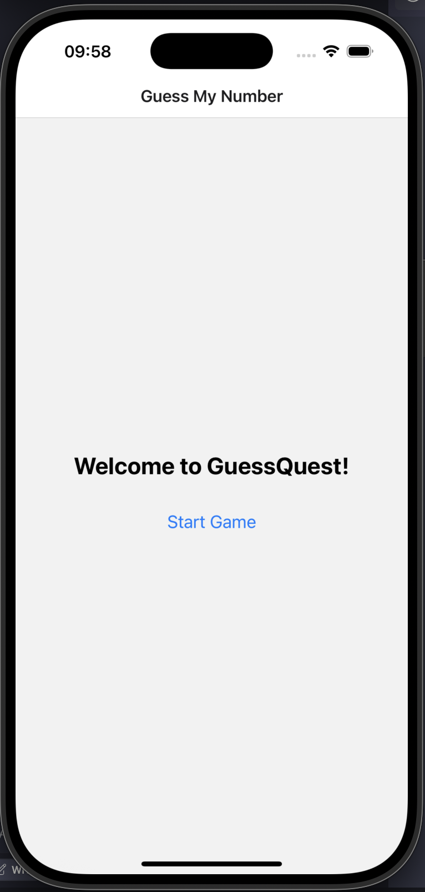

# Week 3, Session 7: Introduction to React Navigation

**Objective:** To learn the fundamentals of multi-screen navigation in React Native using the React Navigation library, focusing on the Stack Navigator pattern for the "GuessQuest" project.

---

## Session Outline

1.  **Core Concepts:** Understand why a dedicated navigation library is essential and learn the theory behind the Stack Navigator pattern.
2.  **Code Implementation:** Set up a navigator in `App.tsx` using `<NavigationContainer>`, `<Stack.Navigator>`, and `<Stack.Screen>`.
3.  **Practical Application:** Learn how to trigger navigation between screens and customize screen-specific options like the header title.
4.  **Student Task:** A hands-on exercise to practice configuring a screen's options.

{width=30%}
---

## From One Screen to Many

In the previous module, we mastered building single-screen applications. We learned to manage state, handle user input, and render dynamic lists. However, most real-world applications consist of multiple screens. This session bridges that gap by introducing a structured way to manage navigation between different parts of an app.

### The Problem: Why Do We Need a Navigation Library?

Imagine any app on your phone—they all have multiple screens (e.g., Settings → Wi-Fi → Select Network). Manually managing the presentation of these screens, passing data between them, and handling the device's back button is complex and error-prone. A dedicated navigation library solves this by providing a standardized, robust solution.

### The Solution: React Navigation

**React Navigation** is the community-standard library for handling navigation in React Native. It's powerful, extensible, and provides the building blocks for common navigation patterns.

*   **Stack Navigator:** The most common pattern. New screens are placed on top of a stack, and going back removes the top screen, just like a stack of cards. This is what we'll use for our game.

--- 

## Code Implementation: Building the Navigator

We will now set up the core navigation structure for our "GuessQuest" game, which will have three screens:
*   `StartGameScreen`: The initial screen where the user starts a new game.
*   `GameScreen`: The main screen where the guessing game is played.
*   `GameOverScreen`: The screen shown when the game ends.

### Step 1: Install Dependencies

To get started, you need to install the necessary packages. For packages with native code, it's best practice to use `expo install` to ensure version compatibility.

**Copy and paste this command into your terminal:**

```bash
npm install @react-navigation/native @react-navigation/native-stack
```

**Then install the peer dependencies:**

```bash
npx expo install react-native-screens react-native-safe-area-context
```

### Step 2: Structure the Navigator in `App.tsx`

The heart of our navigation logic will reside in `App.tsx`. Here, we define the navigation container and register all the screens that can be navigated to.

**Open your App.tsx file and replace its contents with this code:**

```tsx
// App.tsx
import { NavigationContainer } from '@react-navigation/native';
import { createNativeStackNavigator } from '@react-navigation/native-stack';

// Import your screen components
import StartGameScreen from './screens/StartGameScreen';
import GameScreen from './screens/GameScreen';
import GameOverScreen from './screens/GameOverScreen';

// Create the stack navigator instance
const Stack = createNativeStackNavigator();

export default function App() {
  return (
    <NavigationContainer>
      <Stack.Navigator initialRouteName="StartGame">
        <Stack.Screen name="StartGame" component={StartGameScreen} />
        <Stack.Screen name="Game" component={GameScreen} />
        <Stack.Screen name="GameOver" component={GameOverScreen} />
      </Stack.Navigator>
    </NavigationContainer>
  );
}
```

**Key Components Breakdown:**
1.  **`<NavigationContainer>`**: The root wrapper that holds the entire navigation state.
2.  **`<Stack.Navigator>`**: The component that implements the stack pattern. The first `<Stack.Screen>` listed will be the initial screen unless `initialRouteName` is set.
3.  **`<Stack.Screen>`**: This component registers a screen. It requires two key props:
    *   `name`: A unique string that acts as the identifier for this screen.
    *   `component`: The actual React component to be rendered for this screen.

### Step 3: Triggering Navigation

React Navigation automatically passes a special `navigation` prop to any component registered in a `<Stack.Screen>`. This prop contains methods to dispatch navigation actions.

**Create a StartGameScreen.tsx file in a screens folder with this code:**

```tsx
// screens/StartGameScreen.tsx
import React from 'react';
import { View, Text, Button, StyleSheet } from 'react-native';
import { NativeStackNavigationProp } from '@react-navigation/native-stack';

// Define the type for our navigation prop
type RootStackParamList = {
  StartGame: undefined;
  Game: undefined;
  GameOver: undefined;
};

type StartGameScreenProps = {
  navigation: NativeStackNavigationProp<RootStackParamList, 'StartGame'>;
};

function StartGameScreen({ navigation }: StartGameScreenProps) { 
  
  function handleStartGame() {
    // Navigate to the Game screen
    navigation.navigate('Game'); 
  }

  return (
    <View style={styles.container}>
      <Text style={styles.title}>Welcome to GuessQuest!</Text>
      <Button title="Start Game" onPress={handleStartGame} />
    </View>
  );
}

const styles = StyleSheet.create({
  container: {
    flex: 1,
    justifyContent: 'center',
    alignItems: 'center',
    padding: 16,
  },
  title: {
    fontSize: 24,
    fontWeight: 'bold',
    marginBottom: 24,
  },
});

export default StartGameScreen;
```

--- 

## Student Task: Customize a Screen's Header

By default, the header title for a screen is its `name`. Let's change it to something more user-friendly.

**Your Goal:** In `App.tsx`, modify the `<Stack.Screen>` for the `StartGameScreen` to set a custom header title.

**Steps:**
1. Open your `App.tsx` file
2. Find the `<Stack.Screen>` component for the StartGame screen
3. Add an `options` prop with a title property

**Hint:** The `<Stack.Screen>` component accepts an `options` prop, which takes an object for configuration.

<details>
<summary>Click for the solution</summary>

```tsx
// In App.tsx, find this line:
<Stack.Screen name="StartGame" component={StartGameScreen} />

// And replace it with:
<Stack.Screen 
  name="StartGame" 
  component={StartGameScreen} 
  options={{
    title: 'Guess My Number' // This sets the header title
  }} 
/>
```

</details>

## Challenge Exercises

Now that you've learned the basics of React Navigation, try these challenges to enhance your GuessQuest app. Each challenge builds on the previous one, so it's best to complete them in order.

### Challenge 1: Customize Header Styles

**Goal:** Make the navigation headers more visually appealing by adding custom colors and styling.

**Why this matters:** Custom header styling creates a more polished and branded user experience. It helps establish visual hierarchy and makes your app look professional.

**Detailed Steps:**
1. Open your `App.tsx` file
2. Locate your `<Stack.Navigator>` component
3. Add a `screenOptions` prop to the `<Stack.Navigator>` component
4. Inside `screenOptions`, add the following style properties:
   - `headerStyle`: Controls the header's background color
   - `headerTintColor`: Controls the color of the header text and icons
   - `headerTitleStyle`: Controls the styling of the header title text

**Tip:** Choose colors that complement each other and reflect your app's theme.

<details>
<summary>Click for the solution</summary>

```tsx
// In App.tsx, update your Stack.Navigator:
<Stack.Navigator 
  initialRouteName="StartGame"
  screenOptions={{
    // Challenge 1: Custom Header Styles
    headerStyle: {
      backgroundColor: '#6a1b9a', // Purple header background
    },
    headerTintColor: '#fff', // White text color
    headerTitleStyle: {
      fontWeight: 'bold',
    },
  }}
>
  {/* Your Stack.Screen components */}
</Stack.Navigator>
```

**What this does:**
- Sets a purple background color for all headers
- Makes all header text and icons white
- Makes the header title text bold for better visibility

</details>

### Challenge 2: Add a Custom Back Button

**Goal:** Replace the default back button with a custom icon or text.

**Why this matters:** Custom navigation elements allow for more control over your app's user experience and can better match your app's design language.

**Detailed Steps:**
1. First, install the Expo icons package if you haven't already:
   ```bash
   npx expo install @expo/vector-icons
   ```
2. In your `App.tsx` file, import the necessary components:
   ```tsx
   import { TouchableOpacity } from 'react-native';
   import { Ionicons } from '@expo/vector-icons';
   ```
3. Find the `<Stack.Screen>` component for your Game screen
4. Replace the simple options object with a function that receives navigation props
5. Add a `headerLeft` function that returns your custom back button component

**Tip:** The `headerLeft` function gives you complete control over the left side of the header, including the back button.

<details>
<summary>Click for the solution</summary>

```tsx
// In App.tsx, update your GameScreen component:
import { TouchableOpacity } from 'react-native';
import { Ionicons } from '@expo/vector-icons';

// Then in your Stack.Navigator:
<Stack.Screen 
  name="Game" 
  component={GameScreen} 
  options={({ navigation }) => ({
    title: 'Playing Game',
    // Challenge 2: Custom Back Button
    headerLeft: () => (
      <TouchableOpacity 
        onPress={() => navigation.goBack()}
        style={{ marginLeft: 10 }}
      >
        <Ionicons name="arrow-back" size={24} color="white" />
      </TouchableOpacity>
    ),
  })} 
/>
```

**What this does:**
- Creates a touchable area on the left side of the header
- Uses the Ionicons library to display an arrow icon
- When pressed, it calls `navigation.goBack()` to navigate to the previous screen
- The `marginLeft: 10` adds some spacing between the icon and the edge of the screen

</details>

### Challenge 3: Add Animation to Screen Transitions

**Goal:** Make screen transitions more engaging with custom animations.

**Why this matters:** Animations provide visual feedback during navigation and make your app feel more dynamic and responsive.

**Detailed Steps:**
1. In your `App.tsx` file, locate your `<Stack.Navigator>` component
2. Inside the `screenOptions` object, add an `animation` property
3. Set it to one of the available animation types: `'slide_from_right'`, `'slide_from_bottom'`, or `'fade'`

**Tip:** Different animations convey different meanings. Horizontal slides are common for moving between pages at the same level, while vertical slides often indicate moving up or down in a hierarchy.

<details>
<summary>Click for the solution</summary>

```tsx
// In App.tsx, update your Stack.Navigator screenOptions:
<Stack.Navigator
  initialRouteName="StartGame"
  screenOptions={{
    // Other options from Challenge 1...
    
    // Challenge 3: Screen Transitions
    animation: 'slide_from_right', // Horizontal slide animation
    // You can also try:
    // animation: 'slide_from_bottom',
    // animation: 'fade',
  }}
>
  {/* Your Stack.Screen components */}
</Stack.Navigator>
```

**What this does:**
- Applies a slide-from-right animation when navigating between screens
- This creates a smooth transition effect instead of an abrupt change
- The animation helps users understand the navigation flow

**Note:** The native stack navigator in React Navigation 6+ uses the `animation` property instead of `cardStyleInterpolator` which was used in older versions.

</details>

### Challenge 4: Pass Data Between Screens

**Goal:** Create a complete data flow by passing a player's name from the StartGame screen through the Game screen to the GameOver screen.

**Why this matters:** Passing data between screens is essential for creating cohesive user experiences where information entered on one screen affects what's displayed on subsequent screens.

**Detailed Steps:**

#### Step 1: Create a shared types file
1. Create a new folder called `types` in your project root
2. Create a file called `navigation.ts` inside the `types` folder
3. Define your route parameter list with proper typing for all screens

#### Step 2: Update StartGameScreen
1. Import the shared types and useState hook
2. Add a TextInput component to collect the player's name
3. Store the name in state with useState
4. Pass the name as a parameter when navigating to the Game screen

#### Step 3: Update GameScreen
1. Import the RouteProp type and update props type
2. Extract the playerName from route.params
3. Display the name on the screen
4. Pass the name (and other game data) when navigating to GameOver

#### Step 4: Update GameOverScreen
1. Update props type to include route
2. Extract parameters from route.params
3. Display personalized results with the player's name

<details>
<summary>Click for the solution</summary>

```tsx
// Step 1: Create types/navigation.ts
export type RootStackParamList = {
  StartGame: undefined;
  Game: { 
    playerName: string;
  };
  GameOver: { 
    playerName: string;
    targetNumber: number;
    guessCount: number;
    gaveUp?: boolean;
  };
};

// Step 2: Update StartGameScreen.tsx
import React, { useState } from 'react';
import { View, Text, TextInput, Button, StyleSheet } from 'react-native';
import { NativeStackNavigationProp } from '@react-navigation/native-stack';

// Import shared navigation types
import { RootStackParamList } from '../types/navigation';

type StartGameScreenProps = {
  navigation: NativeStackNavigationProp<RootStackParamList, 'StartGame'>;
};

function StartGameScreen({ navigation }: StartGameScreenProps) { 
  // Added state to store the player's name
  const [playerName, setPlayerName] = useState('');
  
  function handleStartGame() {
    // Pass the player name as a parameter when navigating
    navigation.navigate('Game', { 
      playerName: playerName.trim() || 'Player' 
    }); 
  }

  return (
    <View style={styles.container}>
      <Text style={styles.title}>Welcome to GuessQuest!</Text>
      
      {/* Added TextInput for player name */}
      <TextInput
        style={styles.input}
        placeholder="Enter your name"
        value={playerName}
        onChangeText={setPlayerName}
        autoCorrect={false}
        maxLength={20}
      />
      
      <Button title="Start Game" onPress={handleStartGame} />
    </View>
  );
}

// Step 3: Update GameScreen.tsx
import { RouteProp } from '@react-navigation/native';

type GameScreenProps = {
  navigation: NativeStackNavigationProp<RootStackParamList, 'Game'>;
  route: RouteProp<RootStackParamList, 'Game'>;
};

function GameScreen({ navigation, route }: GameScreenProps) { 
  // Extract the playerName from route.params
  const { playerName } = route.params;
  
  // Added state for game logic
  const [targetNumber] = useState(() => Math.floor(Math.random() * 100) + 1);
  const [guessCount, setGuessCount] = useState(0);
  
  // Function to end the game and pass data to GameOver screen
  function handleEndGame(gaveUp = false) {
    navigation.navigate('GameOver', {
      playerName,
      targetNumber,
      guessCount,
      gaveUp
    });
  }
  
  return (
    <View style={styles.container}>
      {/* Display personalized greeting with the player's name */}
      <Text style={styles.greeting}>Hello, {playerName}!</Text>
      <Text style={styles.title}>Guess a number between 1 and 100</Text>
      
      {/* Game UI */}
      <Button title="End Game" onPress={() => handleEndGame(true)} />
    </View>
  );
}

// Step 4: Update GameOverScreen.tsx
type GameOverScreenProps = {
  navigation: NativeStackNavigationProp<RootStackParamList, 'GameOver'>;
  route: RouteProp<RootStackParamList, 'GameOver'>;
};

function GameOverScreen({ navigation, route }: GameOverScreenProps) { 
  // Extract parameters from route
  const { playerName, targetNumber, guessCount, gaveUp = false } = route.params;
  
  return (
    <View style={styles.container}>
      <Text style={styles.title}>Game Over!</Text>
      
      {/* Display personalized results */}
      <View style={styles.resultCard}>
        <Text style={styles.playerName}>{playerName}'s Results</Text>
        
        {gaveUp ? (
          <Text style={styles.resultText}>You gave up after {guessCount} guesses.</Text>
        ) : (
          <Text style={styles.resultText}>You used {guessCount} out of 3 guesses.</Text>
        )}
        
        <Text style={styles.numberText}>The number was: {targetNumber}</Text>
      </View>
      
      <Button title="Play Again" onPress={() => navigation.navigate('StartGame')} />
    </View>
  );
}
```

**What this does:**
- Creates a centralized type definition for navigation parameters
- Implements a complete data flow through all screens
- Provides type safety with TypeScript
- Creates a personalized experience by using the player's name throughout the app
- Demonstrates how to pass multiple parameters between screens

</details>

--- 

## Session Recap

*   **Navigation is Essential:** We learned that a dedicated library is crucial for managing multi-screen apps.
*   **Stack Pattern:** We understood the intuitive stack-based navigation flow.
*   **Core Components:** We implemented a navigator using `<NavigationContainer>`, `<Stack.Navigator>`, and `<Stack.Screen>`.
*   **Triggering Navigation:** We used the `navigation.navigate()` method to move between screens.
*   **Customization:** We learned to customize screen appearance using the `options` prop.

**Next Session:** We will learn how to pass data (like the user's chosen number) from one screen to another using route parameters.

---

## Final Code for Session 7

<details>
<summary>Click to see the final App.tsx code</summary>

```tsx
// App.tsx - Final Version
import { NavigationContainer } from '@react-navigation/native';
import { createNativeStackNavigator } from '@react-navigation/native-stack';

// Import your screen components
import StartGameScreen from './screens/StartGameScreen';
import GameScreen from './screens/GameScreen';
import GameOverScreen from './screens/GameOverScreen';

// Create the stack navigator instance
const Stack = createNativeStackNavigator();

export default function App() {
  return (
    <NavigationContainer>
      <Stack.Navigator initialRouteName="StartGame">
        <Stack.Screen 
          name="StartGame" 
          component={StartGameScreen} 
          options={{
            title: 'Guess My Number' // Custom header title
          }}
        />
        <Stack.Screen name="Game" component={GameScreen} />
        <Stack.Screen name="GameOver" component={GameOverScreen} />
      </Stack.Navigator>
    </NavigationContainer>
  );
}
```

</details>

<details>
<summary>Click to see the final StartGameScreen.tsx code</summary>

```tsx
// screens/StartGameScreen.tsx - Final Version
import React from 'react';
import { View, Text, Button, StyleSheet } from 'react-native';
import { NativeStackNavigationProp } from '@react-navigation/native-stack';

// Define the type for our navigation prop
type RootStackParamList = {
  StartGame: undefined;
  Game: undefined;
  GameOver: undefined;
};

type StartGameScreenProps = {
  navigation: NativeStackNavigationProp<RootStackParamList, 'StartGame'>;
};

function StartGameScreen({ navigation }: StartGameScreenProps) { 
  
  function handleStartGame() {
    // Navigate to the Game screen
    navigation.navigate('Game'); 
  }

  return (
    <View style={styles.container}>
      <Text style={styles.title}>Welcome to GuessQuest!</Text>
      <Button title="Start Game" onPress={handleStartGame} />
    </View>
  );
}

const styles = StyleSheet.create({
  container: {
    flex: 1,
    justifyContent: 'center',
    alignItems: 'center',
    padding: 16,
  },
  title: {
    fontSize: 24,
    fontWeight: 'bold',
    marginBottom: 24,
  },
});

export default StartGameScreen;
```

</details>
```

</details>