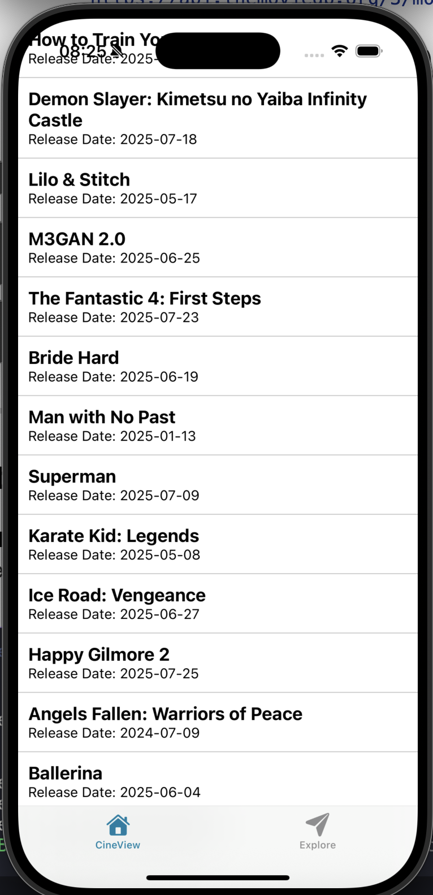
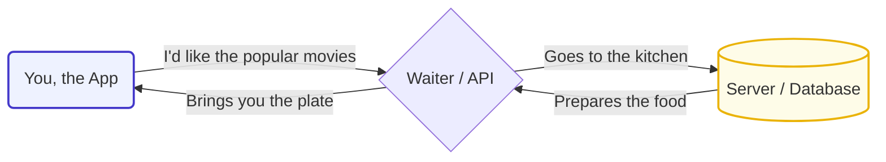
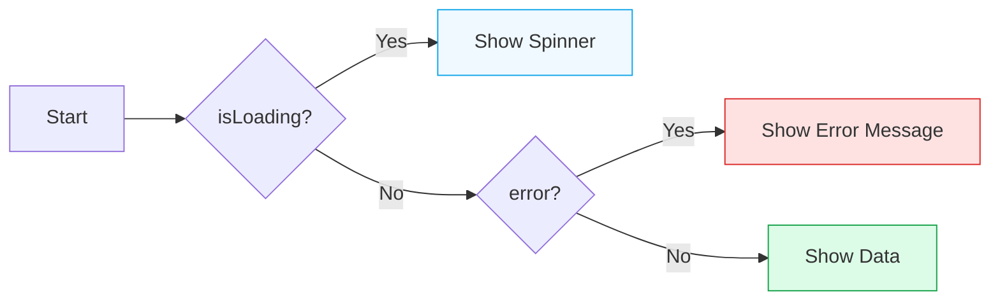
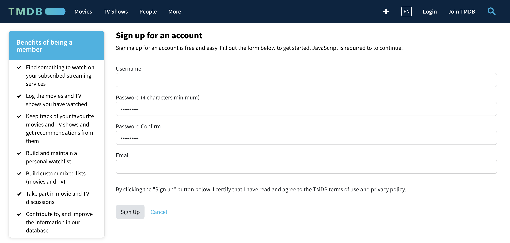
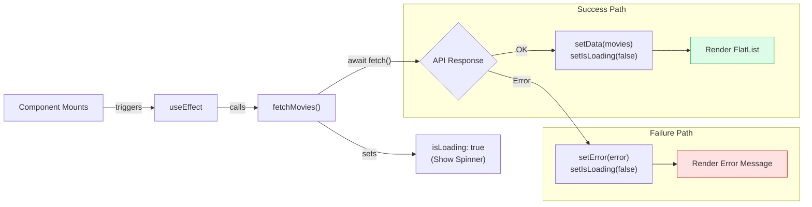

# Week 4, Session 10: Connecting to the World with APIs

**Project:** "CineView" - A Movie Discovery App

**Objective:** Learn how to fetch live data from a third-party REST API (The Movie Database) and display it in our React Native app, "CineView". Master asynchronous JavaScript, state management for API calls, and rendering dynamic data.

{width=400}

---

## Session Outline

1. **Core Concepts: The "Why"**
    - What is a "side effect" in React?
    - Understanding Asynchronous JavaScript with `async/await`.
    - Managing the three states of an API call: Loading, Data, and Error.
2. **Code Walkthrough: The "How"**
    - Using the `useEffect` hook to fetch data when a component loads.
    - Displaying an `ActivityIndicator` while data is being fetched.
    - Rendering the fetched data in a `<FlatList>`.
3. **Student Task:** Make our app more robust by handling network errors gracefully.

---

## Review: Where We Left Off

Last week, we made our "GuessQuest" game fully adaptive. We learned how to:

- Use `<SafeAreaView>` to keep our UI away from device notches.
- Create responsive layouts for landscape mode with the `useWindowDimensions` hook.
- Apply platform-specific styles for iOS and Android.

> The question we ended with was: **"How do we get data from outside our app?"** Today, we answer that question.

---

## Part 1: Core Concepts

### The Problem: Static vs. Dynamic Apps

So far, all data in our apps has been **hard-coded** (written directly into the source code). This makes our apps **static**. Real-world applications are **dynamic**—they need to fetch the latest information from a server. This is achieved by communicating with a server over the internet using an **API**.

### What is an API?

**API** stands for **Application Programming Interface**. Think of it as a waiter in a restaurant. You (the app) don't go into the kitchen (the server). You give your order (an API request) to the waiter, and the waiter brings you the food (the data).



### The Challenge: Asynchronous Operations

Fetching data from an API takes time. We can't freeze our app while we wait. This is an **asynchronous operation**. JavaScript gives us a modern, clean syntax for handling this: `async/await`. It lets us write asynchronous code that looks and reads like synchronous code.

### Core Concept 1: Side Effects & `useEffect`

A **side effect** is any interaction your component has with the "outside world" that isn't part of rendering the UI. Data fetching is a perfect example.

You can't run this code directly in your component. It needs to be managed properly within the component's lifecycle using the `useEffect` hook.

```tsx
import React, { useEffect } from 'react';

useEffect(() => {
  // Your side effect code goes here.
  // This function runs after the component has rendered.
}, []); // The dependency array.
```

An **empty dependency array `[]`** is critical. It tells React to run this effect **only once**, right after the component mounts for the first time. This is perfect for our initial data fetch.

### Core Concept 2: Managing API State

When you make an API call, you must track its progress. There are three states your component needs to manage, which we will handle with `useState`:

- `isLoading`: Are we currently waiting for data? (Show a spinner)
- `data`: The data we successfully fetched. (Show the data)
- `error`: Did something go wrong? (Show an error message)



---

## Understanding the Entry Point in Expo Router

Before Expo Router, traditional React apps (web or native) started from a single entry file, like `main.tsx` (web) or `App.tsx` (React Native). This file would render the root component and manage navigation manually.

With Expo Router, the entry point is determined by the structure of the `app` directory. Each file or folder inside `app` automatically becomes a route or screen. For example:

- `app/(tabs)/index.tsx` is the default screen for the first tab.
- `app/_layout.tsx` can define shared layout or navigation for all screens.

There is no need for a manual `main.tsx` or `App.tsx`—Expo Router handles routing and screen rendering automatically based on your file structure. This makes navigation setup much simpler and more scalable for larger apps.

---

## Part 2: Code Walkthrough - Building "CineView"

### Prerequisite: Getting Your Free API Key

To fetch movie data, our app needs to authenticate with The Movie Database (TMDB). This requires a personal API key, which is free.

**Follow these steps to get your key:**

1.  **Sign Up on TMDB:** Go to [**The Movie Database (TMDB) Sign Up Page**](https://www.themoviedb.org/signup) and create a free account. You'll need to verify your email.
{width=100%}
2.  **Navigate to API Settings:** Once logged in, click your profile icon in the top right, go to **Settings**, and then find the **API** tab in the left-hand menu.
3.  **Request a Key:** You may need to fill out a short form to request an API key. Select "Developer" as the type of use.
4.  **Copy Your API Key:** Once approved, you will see an **API Key (v3 auth)**. This is the key you need. Copy it carefully.

> **Important:** Keep your API key private. In a real-world application, you would not hard-code this directly into your app's source code. For this learning exercise, we will place it in our fetch request for simplicity.

### Step 0: Init React Native Project with Expo

We'll use Expo Go for easier development and testing across devices.

```bash
npx create-expo-app CineView
cd CineView
npx expo install react-native-screens react-native-safe-area-context
```

To run the app:

```bash
npx expo start
```

You can then scan the QR code with your phone's camera (iOS) or the Expo Go app (Android) to open the app.


### Step 1: Set Up State in `MoviesScreen.tsx`

**Explanation:**
We need to track three things in our component: whether we're loading data, the movie data itself, and any error that might occur. We use React's `useState` hook for this, and TypeScript types for safety.

```tsx
// In screens/MoviesScreen.tsx
import React, { useState } from 'react';

// Movie type definition
type Movie = {
  id: number;
  title: string;
  release_date: string;
};

function MoviesScreen() {
  // 1. Track loading state
  const [isLoading, setIsLoading] = useState(true);
  // 2. Store the fetched movies
  const [data, setData] = useState<Movie[]>([]);
  // 3. Track any error
  const [error, setError] = useState<Error | null>(null);
  // ...
}
```

---

### Step 2: Fetch Data with `useEffect`

**Explanation:**
To fetch data when the component mounts, we use the `useEffect` hook. Inside, we define an async function to call the TMDB API, handle errors, and update our state accordingly.

```tsx
import React, { useEffect } from 'react';

// ...inside MoviesScreen...
useEffect(() => {
  const fetchMovies = async () => {
    try {
      // Fetch data from TMDB
      const response = await fetch(
        'https://api.themoviedb.org/3/movie/popular?api_key=YOUR_API_KEY'
      );
      const json = await response.json();
      setData(json.results); // Store results
    } catch (err) {
      setError(err instanceof Error ? err : new Error('An unknown error occurred'));
    } finally {
      setIsLoading(false); // Hide spinner
    }
  };
  fetchMovies();
}, []); // Runs only once on mount
```

---

### Step 3: Render UI Based on State

**Explanation:**
We use conditional rendering to show a spinner while loading, an error message if something goes wrong, or the movie list if data loads successfully. This ensures a smooth user experience.

```tsx
// ...inside MoviesScreen...
if (isLoading) {
  return (
    <View style={styles.centered}>
      <ActivityIndicator size="large" color="#4f46e5" />
    </View>
  );
}

if (error) {
  return (
    <View style={styles.centered}>
      <Text>Failed to fetch movies. Please check your connection.</Text>
    </View>
  );
}

return (
  <View style={styles.container}>
    <FlatList
      data={data}
      keyExtractor={({ id }) => id.toString()}
      renderItem={({ item }) => (
        <View style={styles.movieItem}>
          <Text style={styles.movieTitle}>{item.title}</Text>
          <Text>Release Date: {item.release_date}</Text>
        </View>
      )}
    />
  </View>
);
```

---

### Step 4: Integrate with Expo Router

**Explanation:**
Expo Router uses the `app` directory structure for routing. The file `app/(tabs)/index.tsx` acts as the home screen for the first tab. We import and render our `MoviesScreen` here, and set the screen title using Expo Router's `Stack.Screen`.

```tsx
// In app/(tabs)/index.tsx
import { StyleSheet } from 'react-native';
import { Stack } from 'expo-router';
import MoviesScreen from '../../screens/MoviesScreen';

export default function HomeScreen() {
  return (
    <>
      <Stack.Screen options={{
        title: 'CineView',
        headerStyle: { backgroundColor: '#4f46e5' },
        headerTintColor: '#fff',
        headerTitleStyle: { fontWeight: 'bold' },
      }} />
      <MoviesScreen />
    </>
  );
}
```

---

Now, your app will start on the movie list screen, fetch data from the TMDB API, and display it with proper loading and error handling!

### Visualizing the Full Data Flow



---

## ✅ Final Code

Here is the complete, final code for the files we created and edited. Use this as a reference to ensure your implementation is correct.

<details>
<summary><strong><code>screens/MoviesScreen.tsx</code></strong></summary>

```tsx
import React, { useState, useEffect } from 'react';
import { View, Text, FlatList, ActivityIndicator, StyleSheet } from 'react-native';

// Movie type definition
type Movie = {
  id: number;
  title: string;
  release_date: string;
};

function MoviesScreen() {
  // 1. Start in a loading state by default
  const [isLoading, setIsLoading] = useState(true);

  // 2. Data will be an array of movies, initially empty
  const [data, setData] = useState<Movie[]>([]);

  // 3. Error will be null initially
  const [error, setError] = useState<Error | null>(null);

  useEffect(() => {
    const fetchMovies = async () => {
      try {
        // Using the API key provided
        const response = await fetch(
          'https://api.themoviedb.org/3/movie/popular?api_key=7ec7d584b11035c6ddb69c329786369a'
        );
        const json = await response.json();
        setData(json.results); // Set data on success
      } catch (err) {
        setError(err instanceof Error ? err : new Error('An unknown error occurred')); // Set error on failure
      } finally {
        // This block runs regardless of success or failure
        setIsLoading(false); // Stop loading
      }
    };

    fetchMovies();
  }, []); // Empty array means this runs only ONCE

  // 1. Handle the loading state
  if (isLoading) {
    return (
      <View style={styles.centered}>
        <ActivityIndicator size="large" color="#4f46e5" />
      </View>
    );
  }

  // 2. Handle the error state
  if (error) {
    return (
      <View style={styles.centered}>
        <Text>Failed to fetch movies. Please check your connection.</Text>
      </View>
    );
  }

  // 3. Handle the success state
  return (
    <View style={styles.container}>
      <FlatList
        data={data}
        keyExtractor={({ id }) => id.toString()}
        renderItem={({ item }) => (
          <View style={styles.movieItem}>
            <Text style={styles.movieTitle}>{item.title}</Text>
            <Text>Release Date: {item.release_date}</Text>
          </View>
        )}
      />
    </View>
  );
}

const styles = StyleSheet.create({
  container: {
    flex: 1,
    backgroundColor: '#fff',
  },
  centered: {
    flex: 1,
    justifyContent: 'center',
    alignItems: 'center',
  },
  movieItem: {
    padding: 10,
    borderBottomWidth: 1,
    borderBottomColor: '#ccc',
  },
  movieTitle: {
    fontSize: 18,
    fontWeight: 'bold',
  },
});

export default MoviesScreen;
```

</details>

<details>
<summary><strong><code>app/(tabs)/index.tsx</code></strong></summary>

```tsx
import { StyleSheet } from 'react-native';
import { Stack } from 'expo-router';

// Import our MoviesScreen component
import MoviesScreen from '../../screens/MoviesScreen';

export default function HomeScreen() {
  return (
    <>
      <Stack.Screen options={{ 
        title: 'CineView',
        headerStyle: {
          backgroundColor: '#4f46e5',
        },
        headerTintColor: '#fff',
        headerTitleStyle: {
          fontWeight: 'bold',
        },
      }} />
      <MoviesScreen />
    </>
  );
}

const styles = StyleSheet.create({
  container: {
    flex: 1,
  },
});
```

</details>

---

## Wrap-up & Next Steps

### Session Recap

Congratulations! You've connected your app to the internet. You learned to:

- Understand that data fetching is a **side effect** managed with `useEffect`.
- Use `useEffect(fn, [])` to run code once when a component mounts.
- Master `async/await` to write clean, readable asynchronous code.
- Manage the three key states of an API call: `isLoading`, `data`, and `error`.
- Display live data from an API in a `<FlatList>`.

### Conceptual Bridge to Session 11

**The Next Challenge:** Our "CineView" app will soon have a `MovieDetailsScreen` and a `FavoritesScreen`. They will all need access to the same data. Passing props everywhere is messy.

**Next time:** We will learn how to manage application-wide state cleanly without "prop drilling" using the **React Context API**.