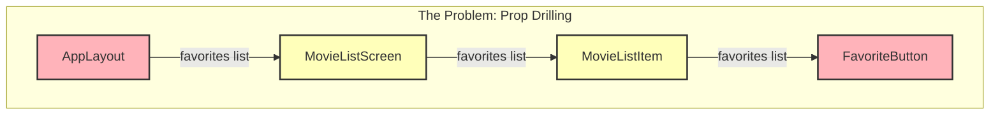

# Week 4, Session 11: Managing Global State with the Context API

**Objective:** Learn how to fetch live data from a third-party REST API (The Movie Database) and display it in our React Native app, "CineView". Master asynchronous JavaScript, state management for API calls, and rendering dynamic data.


---

## Session Outline

1.  **Core Concepts: The "Why"**
    *   What is "prop drilling" and why is it a problem?
    *   How does the React Context API provide a clean solution?
    *   Understanding the three key parts: `createContext`, `<Provider>`, and `useContext`.
2.  **Code Walkthrough: The "How"**
    *   Creating a dedicated context file to hold our state and logic.
    *   "Providing" state to our entire application.
    *   "Consuming" that state in any component that needs it.
3.  **Your Task:** Use the context to display which movies are favorites in our list.

---

## Review: Where We Left Off

In our last session, we successfully connected our "CineView" app to the TMDB API and fetched a list of movies.

**Conceptual Bridge from Session 10:**
> "Fetching data is great, but what if multiple screens need access to it? Passing props everywhere is messy."

Today, we solve this exact problem.

---

## Part 1: Core Concepts - The "Why" of Global State

### The Problem: "Prop Drilling"

"Prop drilling" is when you pass data from a parent component down through multiple layers of child components, even if the intermediate components don't need the data themselves. They just act as a conduit.

Imagine our `app/_layout.tsx` holds the list of favorite movie IDs. To get that list to a `FavoriteButton` inside a `MovieListItem` component, we'd have to pass it down through every component in between.

### Visualizing Prop Drilling

This diagram shows state being passed from our main component all the way down, even though the intermediate components don't use it.


*The yellow components are "drilled"—they are forced to handle a prop they don't actually need.*

### Why is Prop Drilling a Problem?

*   **Code Maintenance:** If you need to change the prop's name or data structure, you have to find and edit **every single file** in the chain.
*   **Reduced Readability:** It's difficult to know which props a component **actually uses** versus which ones it's just passing through.
*   **Difficult Refactoring:** Moving components around becomes a complex task of re-wiring all the props that were passing through them.
*   **Unnecessary Re-renders:** It can cause components to re-render when a prop they don't even use changes, potentially harming performance.

### The Solution: The React Context API

**The Official Definition:** "Context provides a way to pass data through the component tree without having to pass props down manually at every level."

**A Simple Analogy:** Think of Context as a **public announcement system** for a specific piece of your app's data.
*   One component gets on the microphone (the **Provider**) and announces the data.
*   Any other component, no matter how far away it is, can listen to that announcement directly (using **useContext**).

It completely bypasses the need for prop drilling.

---

## Part 2: Code Walkthrough - Implementing Favorites

### The Three Key Parts of Context

1.  **`createContext()`**: Create the context "channel" and define the default shape of our data.
2.  **`<Context.Provider>`**: Wrap a part of our app with this component. It will hold the actual state and logic, and pass it down via its `value` prop.
3.  **`useContext()`**: In any component that needs the data, call this hook to "subscribe" to the value from the nearest Provider.

### Step 1: Create the Context Directory and File

**Note:** The CineView codebase does not yet have a `context/` (or `store/`) directory. As part of this session, you will create a new directory to hold your Context code.

**Instructions:**
1. In your project root (`week4/CineView`), create a new folder named `context`.
2. Inside this folder, create a new file called `favorites-context.tsx`.

**Path:** `week4/CineView/context/favorites-context.tsx`

This file will be responsible for:
1.  Creating the context itself with `createContext`.
2.  Creating the `FavoritesContextProvider` component that will hold the state (our array of favorite movie IDs) and the functions to manage it.

### Step 2: Define the Context and Provider

In our new file, we define the context and the provider component that will manage our state.

```tsx
// context/favorites-context.tsx
import React, { createContext, useState, ReactNode } from 'react';

// Define the "shape" of our context data and functions
type FavoritesContextType = {
  ids: number[];
  addFavorite: (id: number) => void;
  removeFavorite: (id: number) => void;
};

// Create the context with a default value
export const FavoritesContext = createContext<FavoritesContextType>({
  ids: [],
  addFavorite: (id: number) => {},
  removeFavorite: (id: number) => {},
});

// Create the provider component
function FavoritesContextProvider({ children }: { children: ReactNode }) {
  const [favoriteMovieIds, setFavoriteMovieIds] = useState<number[]>([]);

  function addFavorite(id: number) {
    setFavoriteMovieIds((currentIds) => [...currentIds, id]);
  }

  function removeFavorite(id: number) {
    setFavoriteMovieIds((currentIds) =>
      currentIds.filter((movieId) => movieId !== id)
    );
  }

  // The value that will be passed to all consuming components
  const value = {
    ids: favoriteMovieIds,
    addFavorite: addFavorite,
    removeFavorite: removeFavorite,
  };

  return (
    <FavoritesContext.Provider value={value}>
      {children}
    </FavoritesContext.Provider>
  );
}

export default FavoritesContextProvider;
```

### Step 3: Wrap The App with the Provider

For the context to be available to all our screens, we must wrap our entire app's navigation structure with the provider. In Expo Router, the best place for this is the root layout file.

**File to Modify:** `week4/CineView/app/_layout.tsx`

```tsx
// app/_layout.tsx
import { Stack } from 'expo-router';
import FavoritesContextProvider from '../context/favorites-context'; // 1. Import

export default function RootLayout() {
  return (
    // 2. Wrap the entire Stack navigator with the provider
    <FavoritesContextProvider>
      <Stack>
        <Stack.Screen name="(tabs)" options={{ headerShown: false }} />
        <Stack.Screen name="+not-found" />
      </Stack>
    </FavoritesContextProvider>
  );
}
```

### Step 4: Create and Use the FavoriteButton

Now, any component inside the provider can "listen" to the context. First, let's create a reusable `FavoriteButton` component.

**New Component:** `week4/CineView/components/FavoriteButton.tsx`

```tsx
// components/FavoriteButton.tsx
import React, { useContext } from 'react';
import { Pressable } from 'react-native';
import { Ionicons } from '@expo/vector-icons';
import { FavoritesContext } from '../context/favorites-context';

function FavoriteButton({ movieId }: { movieId: number }) {
  const favoritesCtx = useContext(FavoritesContext);
  const isFavorite = favoritesCtx.ids.includes(movieId);

  function toggleFavorite() {
    if (isFavorite) {
      favoritesCtx.removeFavorite(movieId);
    } else {
      favoritesCtx.addFavorite(movieId);
    }
  }

  return (
    <Pressable onPress={toggleFavorite} style={{ padding: 8 }}>
      <Ionicons
        name={isFavorite ? 'star' : 'star-outline'}
        size={24}
        color="gold"
      />
    </Pressable>
  );
}

export default FavoriteButton;
```

Next, integrate this button into our `MoviesScreen`'s list items.

**File to Modify:** `week4/CineView/screens/MoviesScreen.tsx`

```tsx
// In screens/MoviesScreen.tsx, inside the FlatList's renderItem function...

import FavoriteButton from '../components/FavoriteButton'; // Import the button

// ...

renderItem={({ item }) => (
  <View style={styles.movieItem}>
    <View style={{ flex: 1 }}>
      <Text style={styles.movieTitle}>{item.title}</Text>
      <Text>Release Date: {item.release_date}</Text>
    </View>
    <FavoriteButton movieId={item.id} />
  </View>
)}

// You will also need to update your movieItem style to be a row:
// movieItem: { flexDirection: 'row', justifyContent: 'space-between', alignItems: 'center', ... }
```

---

## Part 3: Your Task (15 minutes)

### Your Goal: Display the Favorites

Your task is to use the global `FavoritesContext` to create a new screen that displays *only* the movies that have been marked as favorites.

1.  **Create a New Screen:** Create `screens/FavoritesScreen.tsx`.
2.  **Fetch All Movies:** Inside this new screen, fetch the same list of popular movies as `MoviesScreen`.
3.  **Consume Context:** Use `useContext` to get the list of favorite movie IDs.
4.  **Filter and Display:** Filter the full movie list to show only the movies whose IDs are in the favorites context.
5.  **Add a New Tab:** Modify `app/(tabs)/_layout.tsx` to add a new tab that points to your `FavoritesScreen`.

### Hint

Your filtering logic in `FavoritesScreen.tsx` will look something like this:

```tsx
const favoritesCtx = useContext(FavoritesContext);
const allMovies = // ... your fetched movie data ...

const favoriteMovies = allMovies.filter(movie => 
  favoritesCtx.ids.includes(movie.id)
);

// Then, use 'favoriteMovies' as the data for your FlatList.
```

---

## Part 4: Wrap-up & Next Steps

### Session Recap

*   Identified **prop drilling** as an anti-pattern.
*   Understood that the **Context API** is React's built-in solution for sharing state.
*   Practiced the three-step process: `createContext`, wrapping with a `<Provider>`, and consuming with `useContext`.

### Conceptual Bridge to Session 12

> "Our app is getting more professional. To add more polish, let's learn how to improve the user experience of our lists and interact with the phone's hardware."

**Next time:** We will explore advanced list features like pull-to-refresh and learn how to access native device APIs like the image picker.
