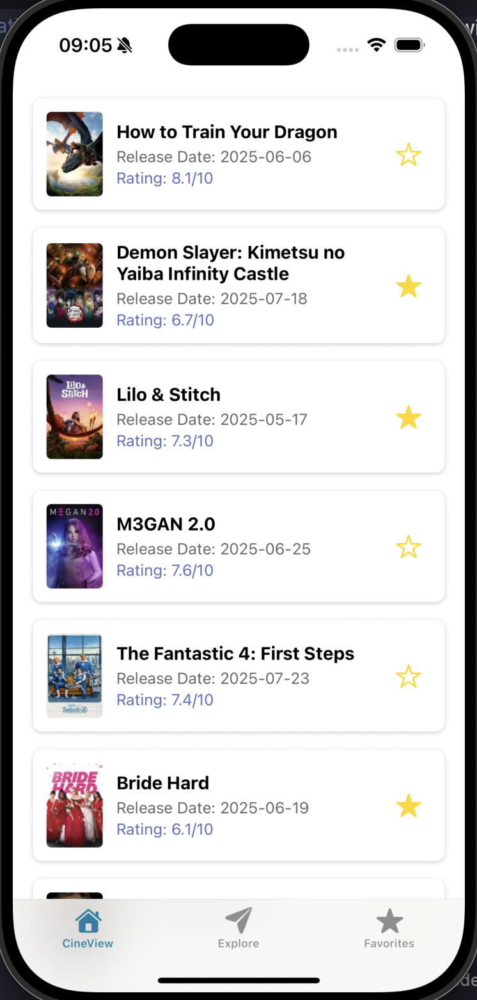

# Week 4, Session 12: Polish & Power - Advanced Lists & Device APIs

**Project:** "CineView" - A Movie Discovery App

**Objective:** Our objective is to add a layer of professional polish and powerful native features to our "CineView" app, including dynamic list updates and interaction with device hardware like the photo library and GPS.

{width=400}

---

## Session Outline

1.  **Core Concepts: The "Why"**
    *   Why a good list User Experience (UX) matters.
    *   Understanding advanced `<FlatList>` features: Pull-to-Refresh & Infinite Scroll.
    *   The importance of the Permissions workflow for accessing device hardware.

2.  **Code Walkthrough: The "How"**
    *   Enhancing our existing movie list to be dynamic and responsive.
    *   Creating a new "Profile" screen.
    *   Accessing the phone's image library using the `expo-image-picker` API.

3.  **Your Task:** Use the `expo-location` API to display the user's GPS coordinates.

---

## Review: Where We Left Off

In our last session, we successfully implemented a global "Favorites" system using the Context API and significantly improved the UI with posters, ratings, and safe area handling. We can now share state across any screen in our app without prop drilling!

We ended with the following thought:

> "Our app is getting more professional. To add more polish, let's learn how to improve the user experience of our lists and interact with the phone's hardware."

Today, we do exactly that.

---

## Part 1: Advanced `<FlatList>` Features

Our current movie list is functional, but its user experience is poor. If new movies become popular, the user has to restart the app to see them, and they can't view more than the first page of results. We'll fix this with two standard UX patterns.

### 1. Pull-to-Refresh

This pattern allows users to swipe down from the top of a list to reload its data. We'll add this to `MoviesScreen.tsx`.

**The Logic:**

1.  Add a new state variable, `isRefreshing`, to track the refresh status.
2.  Create a handler function, `handleRefresh`, that sets `isRefreshing` to `true`, re-fetches the first page of movies, and then sets it back to `false`.
3.  Pass this state and handler to the `<FlatList>`'s `refreshing` and `onRefresh` props.

**Code Implementation:**

In `screens/MoviesScreen.tsx`, add the new state and handler:

```tsx
// Add this state alongside your other state variables
const [isRefreshing, setIsRefreshing] = useState(false);

// This function re-uses your existing fetch logic
const handleRefresh = async () => {
  console.log('Refreshing movie list...');
  setIsRefreshing(true);
  // We need to modify fetchMovies to reset to page 1
  // For now, let's assume it refetches the first page.
  await fetchMovies(); // You might need to adjust fetchMovies to reset data
  setIsRefreshing(false);
  console.log('Refresh complete.');
};
```

Then, update your `<FlatList>` component:

```tsx
<FlatList
  data={data}
  // ... other props

  // New props for pull-to-refresh
  onRefresh={handleRefresh}
  refreshing={isRefreshing}
/>
```

### 2. Infinite Scrolling

This pattern automatically fetches the next page of data as the user approaches the end of the list.

**The Logic:**

1.  Add state to track the `currentPage`.
2.  Refactor the `fetchMovies` function to accept a page number and **append** new data to the existing list instead of replacing it.
3.  Create a `loadMoreMovies` handler that increments the page count and calls the updated `fetchMovies`.
4.  Pass this handler to the `<FlatList>`'s `onEndReached` prop.

**Code Implementation:**

This requires a more significant refactor of `screens/MoviesScreen.tsx`:

```tsx
// Add new state for pagination
const [currentPage, setCurrentPage] = useState(1);

// Refactor fetchMovies to handle pagination and appending data
const fetchMovies = async (page = 1) => {
  // ... set loading state ...
  try {
    const response = await fetch(`https://api.themoviedb.org/3/movie/popular?api_key=YOUR_API_KEY&page=${page}`);
    const json = await response.json();
    
    if (page === 1) {
      // If it's the first page (or a refresh), replace the data
      setData(json.results);
    } else {
      // For subsequent pages, append the new results
      setData(prevData => [...prevData, ...json.results]);
    }
    setCurrentPage(page);
  } catch (e) {
    // ... handle error ...
  } finally {
    // ... set loading state to false ...
  }
};

// Handler for the FlatList
const loadMoreMovies = () => {
  console.log('Loading more movies, page:', currentPage + 1);
  fetchMovies(currentPage + 1);
};
```

Update your `<FlatList>` with the `onEndReached` prop:

```tsx
<FlatList
  data={data}
  // ... other props

  // New props for infinite scroll
  onEndReached={loadMoreMovies}
  onEndReachedThreshold={0.5} // Trigger when 50% from the bottom
/>
```

---

## Part 2: Accessing Device APIs

### The Golden Rule: Always Ask for Permission

Before you can access sensitive user information (like photos, location, or contacts), you **must** ask for the user's permission. This is critical for user trust and App Store compliance. The app should handle permission denial gracefully.

**The Universal Permission Flow:**

1.  **Check:** Do we already have permission?
2.  **Request:** If not, ask the user for permission.
3.  **Execute:** If permission is granted, run the feature. If not, show an alert or disable the feature.

### Creating a Profile Screen with an Image Picker

Our goal is to create a new `ProfileScreen.tsx` where a user can set a profile picture from their phone's photo library.

**1. Installation**

First, install the necessary library:

```bash
npx expo install expo-image-picker
```

**2. Create the Profile Screen and Tab**

You will need to:
*   Create a new file: `screens/ProfileScreen.tsx`.
*   Create a new tab file: `app/(tabs)/profile.tsx` to render the screen.
*   Add the new tab to `app/(tabs)/_layout.tsx` with an appropriate icon.

**3. Code for `ProfileScreen.tsx`**

Here is the complete logic for the profile screen:

```tsx
// screens/ProfileScreen.tsx
import React, { useState } from 'react';
import { View, Button, Image, Text, StyleSheet, Alert } from 'react-native';
import * as ImagePicker from 'expo-image-picker';
import { SafeAreaView } from 'react-native-safe-area-context';

function ProfileScreen() {
  const [pickedImage, setPickedImage] = useState<string | null>(null);

  const verifyPermissions = async () => {
    const { status } = await ImagePicker.requestMediaLibraryPermissionsAsync();
    if (status !== 'granted') {
      Alert.alert(
        'Insufficient Permissions!',
        'You need to grant library permissions to set a profile picture.'
      );
      return false;
    }
    return true;
  };

  const takeImageHandler = async () => {
    const hasPermission = await verifyPermissions();
    if (!hasPermission) {
      return;
    }

    const image = await ImagePicker.launchImageLibraryAsync({
      allowsEditing: true,
      aspect: [1, 1],
      quality: 0.5,
    });

    if (!image.canceled) {
      setPickedImage(image.assets[0].uri);
    }
  };

  return (
    <SafeAreaView style={styles.container}>
      <Text style={styles.title}>My Profile</Text>
      <View style={styles.imagePreview}>
        {!pickedImage ? (
          <Text>No image picked yet.</Text>
        ) : (
          <Image style={styles.image} source={{ uri: pickedImage }} />
        )}
      </View>
      <Button title="Pick an Image from Library" onPress={takeImageHandler} />
    </SafeAreaView>
  );
}

const styles = StyleSheet.create({
  container: {
    flex: 1,
    alignItems: 'center',
    padding: 20,
  },
  title: {
    fontSize: 24,
    fontWeight: 'bold',
    marginBottom: 20,
  },
  imagePreview: {
    width: 200,
    height: 200,
    borderRadius: 100,
    justifyContent: 'center',
    alignItems: 'center',
    backgroundColor: '#e1e1e1',
    marginBottom: 20,
    overflow: 'hidden',
  },
  image: {
    width: '100%',
    height: '100%',
  },
});

export default ProfileScreen;
```

---

## Part 3: Challenge - Get User's Location

Your goal is to reinforce the permission flow pattern by using another device API.

**The Task:** On the same `ProfileScreen`, use the `expo-location` library to get the user's current GPS coordinates and display them in a `<Text>` component below the image picker.

**1. Installation**

```bash
npx expo install expo-location
```

**2. Hint**

The steps are nearly identical to the Image Picker task:

1.  Create a `verifyLocationPermissions` function. Use `Location.requestForegroundPermissionsAsync()`.
2.  Create a `getLocationHandler` function.
3.  If permission is granted, `await Location.getCurrentPositionAsync()`.
4.  Use `useState` to store the coordinates from the result and render them.

**AI Assist Prompt:**

> "Ask an AI to create a reusable custom hook in React Native called `usePermissions`. This hook should accept a permission type from Expo (e.g., `ImagePicker.requestMediaLibraryPermissionsAsync` or `Location.requestForegroundPermissionsAsync`) and return an object containing the permission status, a function to request the permission, and a boolean indicating if permission has been granted. Show how to use this hook in the ProfileScreen to simplify the logic for both the image picker and location."

---

## Session Recap

You've now made "CineView" feel like a professional, modern app!

-   Enhanced the list UX with professional patterns: **Pull-to-Refresh** and **Infinite Scroll**.
-   Mastered the critical **Permission Flow** for accessing native hardware.
-   Successfully integrated the device's media library using `expo-image-picker`.

**Next time:** The Capstone Project begins! We will build a full-stack marketplace app with user authentication and a cloud database.
