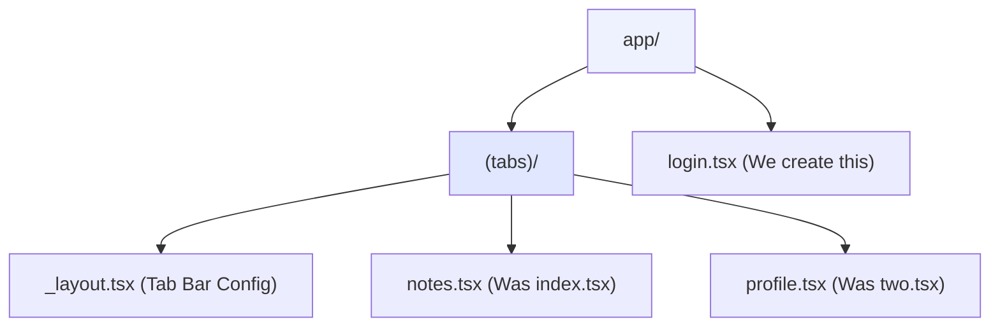
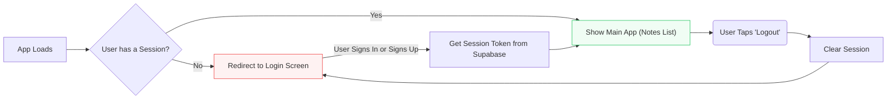
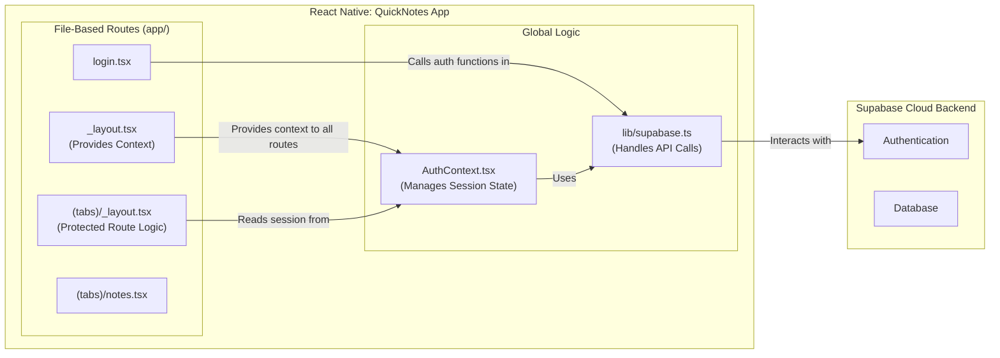

# Week 5, Session 13: Backend & User Authentication

**Project:** "QuickNotes" - A Full-Stack Note-Taking App

**Objective:** Our objective is to transform our static "QuickNotes" UI into a dynamic, full-stack application by adding a backend for user authentication.

---

## Session Outline

1.  **Pre-Session Review:** Ensure our static UI skeleton is ready.
2.  **Core Concepts: The "Why"**
    *   Understanding Backend-as-a-Service (BaaS) with Supabase.
    *   Mapping out the user authentication flow.
    *   Managing global auth state with Context and protecting routes with Expo Router.
3.  **Code Walkthrough: The "How"**
    *   Integrating the Supabase client and Auth Context.
    *   Implementing protected routes in the root layout.
    *   Wiring up the Login screen to communicate with Supabase.
4.  **Your Task:** Complete the auth cycle by implementing the Logout functionality.

---

## Part 1: Pre-Session Task Review - Building the "QuickNotes" UI Skeleton

### The Goal: UI First, Logic Later

Before connecting to a backend, we build a complete, static "skeleton" of our app.

Why this approach?
*   **Focus:** It allows us to focus entirely on layout, styling, and navigation without worrying about data yet.
*   **Preparation:** It provides a ready-made structure to plug our Supabase logic into.
*   **Practice:** It reinforces the core UI and navigation skills learned in previous weeks.

> A solid UI foundation makes backend integration much smoother.

### Project Setup with Expo Router

We start by creating our app using the official Expo tabs template, which gives us the file-based routing structure we need.

1.  Create the app: `npx create-expo-app QuickNotes -t tabs`
2.  Navigate into the directory: `cd QuickNotes`
3.  Start the development server: `npx expo start`

### Understanding the `app` Directory

Expo Router uses your file system to define navigation. Here's what the template gives us:



*   `(tabs)` is a **route group**. Screens inside share the tab bar layout defined in `_layout.tsx`.
*   `login.tsx` is a screen at the root level, outside the tab bar.

### Step-by-Step UI Skeleton Setup

Here is the code to create the complete UI skeleton. Students should follow these steps to have the app ready for the Supabase integration.

#### 1. Create the Login Screen

Create a new file at `app/login.tsx`. This screen is outside the `(tabs)` group, so it won't have the bottom tab bar.

**File: `app/login.tsx`**
```tsx
import React, { useState } from 'react';
import { View, TextInput, Button, StyleSheet, Text, Alert } from 'react-native';

export default function LoginScreen() {
  const [email, setEmail] = useState('');
  const [password, setPassword] = useState('');

  const handleLogin = () => {
    // Logic will be added later
    Alert.alert('Login Info', `Email: ${email}\nPassword: ${password}`);
  };

  const handleSignUp = () => {
    // Logic will be added later
    Alert.alert('Sign Up', 'Redirecting to sign up...');
  };

  return (
    <View style={styles.container}>
      <Text style={styles.title}>QuickNotes</Text>
      <TextInput
        style={styles.input}
        placeholder="Email"
        value={email}
        onChangeText={setEmail}
        keyboardType="email-address"
        autoCapitalize="none"
      />
      <TextInput
        style={styles.input}
        placeholder="Password"
        value={password}
        onChangeText={setPassword}
        secureTextEntry
      />
      <View style={styles.buttonContainer}>
        <Button title="Login" onPress={handleLogin} />
        <Button title="Sign Up" onPress={handleSignUp} color="#6c757d" />
      </View>
    </View>
  );
}

const styles = StyleSheet.create({
  container: {
    flex: 1,
    justifyContent: 'center',
    padding: 20,
    backgroundColor: '#f8f9fa',
  },
  title: {
    fontSize: 32,
    fontWeight: 'bold',
    textAlign: 'center',
    marginBottom: 40,
    color: '#4338ca',
  },
  input: {
    height: 50,
    borderColor: '#ced4da',
    borderWidth: 1,
    borderRadius: 8,
    marginBottom: 15,
    paddingHorizontal: 15,
    backgroundColor: '#fff',
  },
  buttonContainer: {
    marginTop: 10,
  },
});
```

#### 2. Configure the Tab Navigator

Rename `app/(tabs)/two.tsx` to `app/(tabs)/profile.tsx`. Then, update `app/(tabs)/_layout.tsx` to configure the tabs with correct names and icons.

**File: `app/(tabs)/_layout.tsx`**
```tsx
import React from 'react';
import { Tabs } from 'expo-router';
import { Ionicons } from '@expo/vector-icons';

export default function TabLayout() {
  return (
    <Tabs
      screenOptions={{
        tabBarActiveTintColor: '#4f46e5',
        headerStyle: { backgroundColor: '#4f46e5' },
        headerTintColor: '#fff',
      }}>
      <Tabs.Screen
        name="notes"
        options={{
          title: 'My Notes',
          tabBarIcon: ({ color, size }) => (
            <Ionicons name="journal-outline" size={size} color={color} />
          ),
        }}
      />
      <Tabs.Screen
        name="profile"
        options={{
          title: 'Profile',
          tabBarIcon: ({ color, size }) => (
            <Ionicons name="person-circle-outline" size={size} color={color} />
          ),
        }}
      />
    </Tabs>
  );
}

```

#### 3. Create the Notes Screen

This screen will display a list of notes with functionality to add and delete notes (all in-memory for now).

**File: `app/(tabs)/notes.tsx`**
```tsx
import React, { useState } from 'react';
import { View, Text, FlatList, StyleSheet, TouchableOpacity, TextInput, Alert, Modal } from 'react-native';
import { Ionicons } from '@expo/vector-icons';

type Note = {
  id: string;
  title: string;
  content: string;
};

const INITIAL_NOTES: Note[] = [
  { id: 'n1', title: 'Session 13 Prep', content: 'Review Supabase auth flow.' },
  { id: 'n2', title: 'Grocery List', content: 'Milk, Eggs, Bread' },
  { id: 'n3', title: 'Meeting Notes', content: 'Discuss Q3 roadmap and deliverables.' },
];

export default function NotesScreen() {
  const [notes, setNotes] = useState(INITIAL_NOTES);
  const [modalVisible, setModalVisible] = useState(false);
  const [newNoteTitle, setNewNoteTitle] = useState('');
  const [newNoteContent, setNewNoteContent] = useState('');

  // Function to add a new note
  const addNote = () => {
    if (newNoteTitle.trim() === '' || newNoteContent.trim() === '') {
      Alert.alert('Error', 'Please enter both title and content');
      return;
    }

    const newNote = {
      id: `n${Date.now()}`, // Simple unique ID generation
      title: newNoteTitle,
      content: newNoteContent,
    };

    setNotes([...notes, newNote]);
    setNewNoteTitle('');
    setNewNoteContent('');
    setModalVisible(false);
  };

  // Function to delete a note
  const deleteNote = (id: string) => {
    Alert.alert(
      'Delete Note',
      'Are you sure you want to delete this note?',
      [
        { text: 'Cancel', style: 'cancel' },
        { 
          text: 'Delete', 
          onPress: () => {
            const updatedNotes = notes.filter(note => note.id !== id);
            setNotes(updatedNotes);
            console.log('Note deleted:', id, 'Remaining notes:', updatedNotes.length);
          },
          style: 'destructive'
        },
      ]
    );
  };

  return (
    <View style={styles.container}>
      <FlatList
        data={notes}
        keyExtractor={(item) => item.id}
        renderItem={({ item }) => (
          <View style={styles.noteItem}>
            <View style={styles.noteContent}>
              <Text style={styles.noteTitle}>{item.title}</Text>
              <Text>{item.content}</Text>
            </View>
            <TouchableOpacity 
              style={styles.deleteButton}
              onPress={() => deleteNote(item.id)}
            >
              <Ionicons name="trash-outline" size={24} color="#ef4444" />
            </TouchableOpacity>
          </View>
        )}
      />

      {/* Add Note Button */}
      <TouchableOpacity 
        style={styles.addButton}
        onPress={() => setModalVisible(true)}
      >
        <Ionicons name="add" size={24} color="white" />
      </TouchableOpacity>

      {/* New Note Modal */}
      <Modal
        animationType="slide"
        transparent={true}
        visible={modalVisible}
        onRequestClose={() => setModalVisible(false)}
      >
        <View style={styles.modalContainer}>
          <View style={styles.modalContent}>
            <Text style={styles.modalTitle}>Create New Note</Text>
            
            <TextInput
              style={styles.input}
              placeholder="Title"
              value={newNoteTitle}
              onChangeText={setNewNoteTitle}
            />
            
            <TextInput
              style={[styles.input, styles.contentInput]}
              placeholder="Content"
              multiline
              value={newNoteContent}
              onChangeText={setNewNoteContent}
            />
            
            <View style={styles.buttonRow}>
              <TouchableOpacity 
                style={[styles.button, styles.cancelButton]}
                onPress={() => {
                  setModalVisible(false);
                  setNewNoteTitle('');
                  setNewNoteContent('');
                }}
              >
                <Text style={styles.buttonText}>Cancel</Text>
              </TouchableOpacity>
              
              <TouchableOpacity 
                style={[styles.button, styles.saveButton]}
                onPress={addNote}
              >
                <Text style={styles.buttonText}>Save</Text>
              </TouchableOpacity>
            </View>
          </View>
        </View>
      </Modal>
    </View>
  );
}

const styles = StyleSheet.create({
  container: {
    flex: 1,
    backgroundColor: '#fff',
  },
  noteItem: {
    padding: 15,
    borderBottomWidth: 1,
    borderBottomColor: '#ccc',
    flexDirection: 'row',
    justifyContent: 'space-between',
    alignItems: 'center',
  },
  noteContent: {
    flex: 1,
  },
  noteTitle: {
    fontSize: 18,
    fontWeight: 'bold',
    marginBottom: 5,
  },
  deleteButton: {
    padding: 8,
  },
  addButton: {
    position: 'absolute',
    bottom: 20,
    right: 20,
    width: 60,
    height: 60,
    borderRadius: 30,
    backgroundColor: '#4f46e5',
    justifyContent: 'center',
    alignItems: 'center',
    elevation: 5,
    shadowColor: '#000',
    shadowOffset: { width: 0, height: 2 },
    shadowOpacity: 0.25,
    shadowRadius: 3.84,
  },
  modalContainer: {
    flex: 1,
    justifyContent: 'center',
    alignItems: 'center',
    backgroundColor: 'rgba(0, 0, 0, 0.5)',
  },
  modalContent: {
    width: '80%',
    backgroundColor: 'white',
    borderRadius: 10,
    padding: 20,
    elevation: 5,
    shadowColor: '#000',
    shadowOffset: { width: 0, height: 2 },
    shadowOpacity: 0.25,
    shadowRadius: 3.84,
  },
  modalTitle: {
    fontSize: 20,
    fontWeight: 'bold',
    marginBottom: 15,
    textAlign: 'center',
  },
  input: {
    borderWidth: 1,
    borderColor: '#ccc',
    borderRadius: 5,
    padding: 10,
    marginBottom: 15,
  },
  contentInput: {
    height: 100,
    textAlignVertical: 'top',
  },
  buttonRow: {
    flexDirection: 'row',
    justifyContent: 'space-between',
  },
  button: {
    flex: 1,
    padding: 12,
    borderRadius: 5,
    alignItems: 'center',
    marginHorizontal: 5,
  },
  cancelButton: {
    backgroundColor: '#9ca3af',
  },
  saveButton: {
    backgroundColor: '#4f46e5',
  },
  buttonText: {
    color: 'white',
    fontWeight: 'bold',
  },
});
```

#### 4. Create the Profile Screen

This is the screen where the logout button will be added later.

**File: `app/(tabs)/profile.tsx`**
```tsx
import React from 'react';
import { View, Text, StyleSheet, Button } from 'react-native';

export default function ProfileScreen() {
  return (
    <View style={styles.container}>
      <Text style={styles.title}>Profile</Text>
      <Text style={styles.email}>user.email@example.com</Text>
      {/* The Logout button will be wired up later */}
      <View style={styles.buttonContainer}>
        <Button title="Logout" color="#dc3545" onPress={() => {}} />
      </View>
    </View>
  );
}

const styles = StyleSheet.create({
  container: {
    flex: 1,
    alignItems: 'center',
    paddingTop: 40,
    backgroundColor: '#fff',
  },
  title: {
    fontSize: 24,
    fontWeight: 'bold',
    marginBottom: 10,
  },
  email: {
    fontSize: 16,
    color: '#6c757d',
    marginBottom: 30,
  },
  buttonContainer: {
    width: '80%',
  },
});
```

---

## Part 2: Core Concepts - Backend, Auth, and Protected Routes

### The Problem: Local-Only Data

Our current "QuickNotes" app has a major limitation: all notes are hardcoded and exist only on the device's state.

*   **No Syncing:** If you get a new phone, your notes are gone forever.
*   **No Users:** The app has no concept of *who* owns which note.

> To solve this, we need a **backend** to store user accounts and data securely online.

### The Solution: Supabase (BaaS)

**Backend-as-a-Service (BaaS)** platforms provide pre-built backend services we can control through an API. It's like renting a fully-equipped professional kitchen instead of building one yourself.

We will use **Supabase**, an open-source BaaS platform. It gives us all the tools we need for our backend, built on top of enterprise-grade open-source software like PostgreSQL.

### The Authentication Flow

This flow diagram shows the journey a user takes in our app. We need to handle every step.



### Managing Auth State with Context

How does our app know if a user is logged in from every screen? We need a global, app-wide state manager. We will use React's **Context API** again. The `AuthContext` will:

1.  Initialize our Supabase client.
2.  Hold the current user's session state (`session`).
3.  Make this state available to any component in our app that needs it.

### "QuickNotes" Architecture

This is how the pieces of our application will fit together.



---

## Part 3: Code Walkthrough - Integrating Supabase & Expo Router

### Step 1: Initialize Supabase Client

First, we need to tell our app how to connect to our Supabase project.

**New File:** `lib/supabase.ts`

```typescript
import { AppState, Platform } from 'react-native';
import 'react-native-url-polyfill/auto';
import AsyncStorage from '@react-native-async-storage/async-storage';
import { createClient, processLock } from '@supabase/supabase-js';

const supabaseUrl = 'YOUR_SUPABASE_URL';
const supabaseAnonKey = 'YOUR_SUPABASE_ANON_KEY';

export const supabase = createClient(supabaseUrl, supabaseAnonKey, {
  auth: {
    ...(Platform.OS !== "web" ? { storage: AsyncStorage } : {}),
    autoRefreshToken: true,
    persistSession: true,
    detectSessionInUrl: false,
    lock: processLock,
  },
});

// Tells Supabase Auth to continuously refresh the session automatically
// if the app is in the foreground. When this is added, you will continue
// to receive `onAuthStateChange` events with the `TOKEN_REFRESHED` or
// `SIGNED_OUT` event if the user's session is terminated. This should
// only be registered once.
if (Platform.OS !== "web") {
  AppState.addEventListener('change', (state) => {
    if (state === 'active') {
      supabase.auth.startAutoRefresh();
    } else {
      supabase.auth.stopAutoRefresh();
    }
  });
}
```

### Step 2: Create the AuthContext

Next, we create the context that will manage and provide the user's session state to our entire app.

**New File:** `context/AuthContext.tsx`

```typescript
import React, { useState, useEffect, createContext, useContext } from 'react';
import { Session } from '@supabase/supabase-js';
import { supabase } from '../lib/supabase';

// Create a context with a default value
const AuthContext = createContext<{ 
  session: Session | null;
  loading: boolean;
}>({ 
  session: null,
  loading: true 
});

export function AuthProvider({ children }: { children: React.ReactNode }) {
  const [session, setSession] = useState<Session | null>(null);
  const [loading, setLoading] = useState(true);

  useEffect(() => {
    // Get the initial session
    supabase.auth.getSession().then(({ data: { session } }) => {
      setSession(session);
      setLoading(false);
    });

    // Listen for auth changes
    const { data: { subscription } } = supabase.auth.onAuthStateChange((_event, session) => {
      setSession(session);
      setLoading(false);
    });

    // Cleanup subscription on unmount
    return () => subscription.unsubscribe();
  }, []);

  return (
    <AuthContext.Provider value={{ session, loading }}>
      {children}
    </AuthContext.Provider>
  );
}

// Custom hook to use the auth context
export const useAuth = () => useContext(AuthContext);
```

### Step 3: Provide the Context

In Expo Router, the root layout file `app/_layout.tsx` is the perfect place to wrap our entire application in the `AuthProvider`.

```typescript
// app/_layout.tsx
import { AuthProvider } from '../context/AuthContext';
import { Slot } from 'expo-router';

// This is the root layout for the entire app.
export default function RootLayout() {
  return (
    // The AuthProvider wraps all routes, making the session
    // available everywhere.
    <AuthProvider>
      <Slot />
    </AuthProvider>
  );
}
```

### Step 4: Implement Protected Routes

This is the key to securing our app. We'll add logic to our tabs layout that redirects users if they aren't logged in.

**File to Edit:** `app/(tabs)/_layout.tsx`

```typescript
import React, { useEffect } from 'react';
import { Tabs, router } from 'expo-router';
import { Ionicons } from '@expo/vector-icons';
import { useAuth } from '../../context/AuthContext';

export default function TabLayout() {
  const { session, loading } = useAuth();

  // useEffect hook to check the session and redirect.
  useEffect(() => {
    if (!loading && !session) {
      // If not loading and no session, redirect to the login screen.
      router.replace('/login');
    }
  }, [session, loading]);

  // Don't render tabs until we know the authentication state
  if (loading) return null;
  
  // Only render tabs if authenticated
  return (
    <Tabs
      screenOptions={{
        tabBarActiveTintColor: '#4f46e5',
        headerStyle: { backgroundColor: '#4f46e5' },
        headerTintColor: '#fff',
      }}>
      <Tabs.Screen
        name="notes"
        options={{
          title: 'My Notes',
          tabBarIcon: ({ color, size }) => (
            <Ionicons name="journal-outline" size={size} color={color} />
          ),
        }}
      />
      <Tabs.Screen
        name="profile"
        options={{
          title: 'Profile',
          tabBarIcon: ({ color, size }) => (
            <Ionicons name="person-circle-outline" size={size} color={color} />
          ),
        }}
      />
    </Tabs>
  );
}
```

### Step 5: The Login Screen Logic

Our login screen UI is already built. Now we just need to hook up the `onPress` handler for the button.

**File to Edit:** `app/login.tsx`

```typescript
import React, { useState } from 'react';
import { View, Text, TextInput, TouchableOpacity, StyleSheet, Alert } from 'react-native';
import { supabase } from '../lib/supabase';
import { router } from 'expo-router';

export default function LoginScreen() {
  const [email, setEmail] = useState('');
  const [password, setPassword] = useState('');
  const [loading, setLoading] = useState(false);
  
  async function handleLogin() {
    setLoading(true);
    const { error } = await supabase.auth.signInWithPassword({ 
      email, 
      password 
    });

    if (error) {
      Alert.alert('Login Error', error.message);
    } else {
      // On success, redirect to the main app area.
      router.replace('/(tabs)/notes'); 
    }
    setLoading(false);
  }
  
  async function handleSignUp() {
    setLoading(true);
    const { data: { session }, error } = await supabase.auth.signUp({
      email,
      password,
    });

    if (error) {
      Alert.alert('Signup Error', error.message);
    } else if (!session) {
      Alert.alert('Success', 'Please check your email for verification!');
    } else {
      router.replace('/(tabs)/notes');
    }
    setLoading(false);
  }
  
  return (
    <View style={styles.container}>
      <Text style={styles.title}>QuickNotes</Text>
      <Text style={styles.subtitle}>Your thoughts, anywhere, anytime</Text>
      
      <View style={styles.inputContainer}>
        <Text style={styles.label}>Email</Text>
        <TextInput
          style={styles.input}
          placeholder="email@address.com"
          value={email}
          onChangeText={setEmail}
          autoCapitalize="none"
        />
      </View>
      
      <View style={styles.inputContainer}>
        <Text style={styles.label}>Password</Text>
        <TextInput
          style={styles.input}
          placeholder="Password"
          value={password}
          onChangeText={setPassword}
          secureTextEntry
          autoCapitalize="none"
        />
      </View>
      
      <TouchableOpacity 
        style={styles.button} 
        onPress={handleLogin}
        disabled={loading}
      >
        <Text style={styles.buttonText}>
          {loading ? 'Logging in...' : 'Log In'}
        </Text>
      </TouchableOpacity>
      
      <TouchableOpacity 
        style={[styles.button, styles.secondaryButton]}
        onPress={handleSignUp}
        disabled={loading}
      >
        <Text style={[styles.buttonText, styles.secondaryButtonText]}>
          {loading ? 'Signing up...' : 'Sign Up'}
        </Text>
      </TouchableOpacity>
    </View>
  );
}

const styles = StyleSheet.create({
  container: {
    flex: 1,
    padding: 20,
    justifyContent: 'center',
  },
  title: {
    fontSize: 32,
    fontWeight: 'bold',
    marginBottom: 8,
    textAlign: 'center',
    color: '#4f46e5',
  },
  subtitle: {
    fontSize: 16,
    marginBottom: 24,
    textAlign: 'center',
    color: '#6b7280',
  },
  inputContainer: {
    marginBottom: 16,
  },
  label: {
    fontSize: 16,
    marginBottom: 8,
    color: '#374151',
  },
  input: {
    borderWidth: 1,
    borderColor: '#d1d5db',
    borderRadius: 6,
    padding: 12,
    fontSize: 16,
  },
  button: {
    backgroundColor: '#4f46e5',
    padding: 16,
    borderRadius: 6,
    alignItems: 'center',
    marginTop: 8,
  },
  buttonText: {
    color: 'white',
    fontSize: 16,
    fontWeight: '600',
  },
  secondaryButton: {
    backgroundColor: 'transparent',
    borderWidth: 1,
    borderColor: '#4f46e5',
  },
  secondaryButtonText: {
    color: '#4f46e5',
  },
});
```

---

## Part 4: Your Task (15 minutes)

### Your Goal: Complete the Auth Cycle

Your goal is to complete the authentication cycle by implementing the logout functionality.

**The Task:**
On the `profile.tsx` screen, add a "Logout" button. When pressed, this button should sign the user out and redirect them to the login screen.

**Steps:**

1.  Open `app/(tabs)/profile.tsx`.
2.  Import the supabase client and router.
3.  Add a `<Button>` component with the title "Logout".
4.  In its `onPress` handler, call the `supabase.auth.signOut()` method.

**Example Implementation:**

```typescript
import { supabase } from '../../lib/supabase';
import { router } from 'expo-router';

// Inside your component:
async function handleLogout() {
  const { error } = await supabase.auth.signOut();
  
  if (error) {
    Alert.alert('Error', error.message);
  } else {
    // The redirect will happen automatically through our AuthContext
    // But we could also manually redirect if needed
    // router.replace('/login');
  }
}

// In your JSX:
<TouchableOpacity style={styles.logoutButton} onPress={handleLogout}>
  <Text style={styles.logoutButtonText}>Logout</Text>
</TouchableOpacity>
```

### Task Hint

Remember how our protected route works. After you call `supabase.auth.signOut()`:

1.  The `onAuthStateChange` listener in our `AuthContext` will fire.
2.  The `session` state will become `null`.
3.  The `useEffect` in our `(tabs)/_layout.tsx` will see that the session is null and automatically call `router.replace('/login')`.

> You don't need to manually redirect. The reactive system we built does it for you!

### AI Assist Prompt

> "Ask an AI to show you how to implement a 'Sign Up' screen in the QuickNotes app. It should be located at `/signup` and link from the login page. The code should call `supabase.auth.signUp` and handle both success and error cases, including the email confirmation flow."

----

## Part 5: Wrap-up & Next Steps

### Session Recap

Congratulations! You've added a secure backend to your app and created an interactive notes interface.

*   Understood the role of a **Backend-as-a-Service (BaaS)** like Supabase.
*   Managed global authentication state with the **Context API**.
*   Implemented **protected routes** using Expo Router and a `useEffect` hook.
*   Built an interactive Notes screen with add and delete functionality.
*   Successfully integrated Supabase for user sign-in and sign-out.
*   Built a reactive system where the UI automatically responds to auth state changes.
*   Learned how to handle session persistence and auto-refresh for mobile apps.

### Conceptual Bridge to Session 14

**The Next Challenge: Storing Data**

Our users can log in and interact with notes in memory, but their notes are still not being saved anywhere. The next step is to connect to the other major part of our backend: the database.

> "Now that users can log in and create/delete notes locally, they need a place to store their data permanently. Next, we'll connect our app to a cloud database and file storage."

**Next time:** We will learn how to:

* Create tables in Supabase with proper relationships and constraints
* Implement Row Level Security (RLS) policies to ensure data privacy
* Save new notes to the database with real-time synchronization
* Fetch only the notes that belong to the currently logged-in user
* Handle offline capabilities and data synchronization strategies
* Convert our in-memory notes management to use Supabase database

### Additional Resources

* [Supabase React Native Documentation](https://supabase.com/docs/guides/auth/quickstarts/react-native)
* [Expo Router Documentation](https://docs.expo.dev/router/introduction/)
* [React Native Best Practices](https://reactnative.dev/docs/performance)
* [Supabase Database Documentation](https://supabase.com/docs/guides/database)
