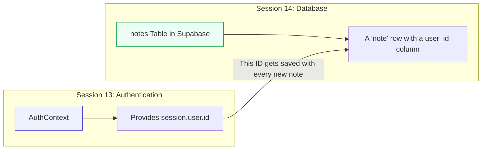

# Week 5, Session 14: Cloud Database & Data Persistence

**Project:** "QuickNotes" - A Full-Stack Note-Taking App

**Objective:** Our objective is to give our "QuickNotes" application a memory by connecting it to a cloud database (Supabase), allowing users to save, retrieve, and secure their own notes.

---

## Session Outline

1.  **Recap & The Problem:** Acknowledging our current app's limitation: static, non-persistent data.
2.  **Core Concepts: The "Why"**
    *   The conceptual bridge from user authentication to data ownership.
    *   Data modeling in a relational database.
    *   The critical difference between client-side filtering and server-side security (Row Level Security).
3.  **Code Walkthrough: The "How"**
    *   **Data Modeling:** Designing and creating the `notes` table in Supabase.
    *   **Reading Data:** Fetching and displaying notes that belong only to the logged-in user.
    *   **Creating Data:** Saving a new note to the database, linked to the current user.
4.  **Your Task:** Secure the database backend using Row Level Security (RLS) to ensure users can only access their own data.

---

## Part 1: The Conceptual Bridge - From Auth to Data

In Session 13, we established *who* the user is via authentication. Today, we use that identity to manage what the user *owns*. The `session` object, which contains `session.user.id`, is the key that links a user to their data.

This is the core concept of any multi-user application:



--- 

## Part 2: Step-by-Step Implementation

### Step 1: Data Modeling in Supabase

Our UI from Session 13 has a title and content for each note. Our database table must reflect this structure. In the Supabase dashboard, navigate to the **Table Editor** and create a new table named `notes`.

**Table Schema: `notes`**

| Column Name  | Data Type                   | Description                                                  |
|--------------|-----------------------------|--------------------------------------------------------------|
| `id`         | `uuid`                      | A unique identifier for each note (Primary Key).             |
| `created_at` | `timestamp with time zone`  | Automatically records when the note was created.             |
| `title`      | `text`                      | The title of the note.                                       |
| `content`    | `text`                      | The actual text content of the note.                         |
| `user_id`    | `uuid`                      | **Links to the `id` of the user who created it.**            |

> **Important:** The `user_id` column is a **foreign key**. You should add a foreign key constraint that references the `id` column in Supabase's built-in `auth.users` table. This enforces data integrity.

### Step 2: Securing the Notes Table with RLS Policies

Before we write the code to interact with our table, we must define its security rules. By default, Supabase blocks all access to tables that have Row Level Security (RLS) enabled. This is a critical security feature.

We need to create policies that explicitly grant permission for users to read and create their own notes.

Navigate to the **SQL Editor** in your Supabase dashboard and run the following SQL commands. 

**1. Create the `SELECT` Policy**
This policy allows a user to fetch only the notes where the `user_id` column matches their own unique ID.

```sql
-- 1. Create a policy for reading notes
CREATE POLICY "Users can read their own notes" 
ON public.notes
FOR SELECT
TO authenticated
USING (auth.uid() = user_id);
```

**2. Create the `INSERT` Policy**
This policy allows a logged-in user to insert a new note, but *only if* they set the `user_id` on the new row to their own ID.

```sql
-- 2. Create a policy for inserting new notes
CREATE POLICY "Users can create their own notes" 
ON public.notes
FOR INSERT
TO authenticated
WITH CHECK (auth.uid() = user_id);
```

> **Heads Up!** If you had tried to run the app code *before* adding this `INSERT` policy, you would have seen an error: `new row violates row-level security policy`. This is Supabase protecting your data as expected!

```sql
-- Create a policy for deleting notes
CREATE POLICY "Users can delete their own notes" 
ON public.notes
FOR DELETE
TO authenticated
USING (auth.uid() = user_id);
```

### Step 3: Updating the Notes Screen for Database Operations

Now, we will modify `app/(tabs)/notes.tsx` to perform all note operations (Create, Read, Delete) directly with our Supabase database. The following is the complete, updated code for the file. Replace the content of your existing file with this, and review the comments to understand the changes.

**File: `app/(tabs)/notes.tsx` (Complete Update)**
```tsx
// NEW: Import Supabase client, Auth context, and hooks
import { supabase } from '../lib/supabase';
import { useAuth } from '../../context/AuthContext';
import React, { useState, useEffect } from 'react'; // MODIFICATION: Added useEffect
import { View, Text, FlatList, StyleSheet, TouchableOpacity, TextInput, Alert, Modal, ActivityIndicator } from 'react-native'; // MODIFICATION: Added ActivityIndicator
import { Ionicons } from '@expo/vector-icons';

// MODIFICATION: Update the Note type to match the database, including created_at
type Note = {
  id: string;
  title: string;
  content: string;
  created_at: string;
};

// REMOVED: The static INITIAL_NOTES array is no longer needed.

export default function NotesScreen() {
  const { session } = useAuth(); // NEW: Get user session
  const [notes, setNotes] = useState<Note[]>([]); // MODIFICATION: Initialize with empty array
  const [modalVisible, setModalVisible] = useState(false);
  const [newNoteTitle, setNewNoteTitle] = useState('');
  const [newNoteContent, setNewNoteContent] = useState('');
  const [loading, setLoading] = useState(false); // NEW: Add a loading state

  // NEW: Function to fetch notes from the database
  const fetchNotes = async () => {
    if (!session) return;
    setLoading(true);
    const { data, error } = await supabase
      .from('notes')
      .select('id, title, content, created_at') // Select all needed columns
      .eq('user_id', session.user.id)
      .order('created_at', { ascending: false });

    if (data) setNotes(data);
    if (error) console.error('Error fetching notes:', error);
    setLoading(false);
  };

  // NEW: Use useEffect to fetch notes when the component loads or session changes
  useEffect(() => {
    fetchNotes();
  }, [session]);

  // MODIFICATION: Make addNote async and insert into Supabase
  const addNote = async () => {
    if (newNoteTitle.trim() === '' || !session?.user) {
      Alert.alert('Error', 'Please enter a title');
      return;
    }
    const { error } = await supabase
      .from('notes')
      .insert({ title: newNoteTitle, content: newNoteContent, user_id: session.user.id });

    if (error) {
      Alert.alert('Error saving note', error.message);
    } else {
      setNewNoteTitle('');
      setNewNoteContent('');
      setModalVisible(false);
      fetchNotes(); // Re-fetch to show the new note
    }
  };

  // MODIFICATION: The delete logic is now async and separate from the confirmation alert
  const deleteNote = async (id: string) => {
    const { error } = await supabase.from('notes').delete().eq('id', id);
    if (error) {
      Alert.alert('Error deleting note', error.message);
    } else {
      // Optimistic update: remove from UI immediately. fetchNotes() provides consistency.
      setNotes(notes.filter(note => note.id !== id));
    }
  };

  const confirmDelete = (id: string) => {
    Alert.alert('Delete Note', 'Are you sure?', [
      { text: 'Cancel', style: 'cancel' },
      { text: 'Delete', onPress: () => deleteNote(id), style: 'destructive' },
    ]);
  };

  // NEW: Show a loading indicator while fetching data
  if (loading) {
    return <ActivityIndicator style={{ flex: 1 }} size="large" />;
  }

  return (
    <View style={styles.container}>
      <FlatList
        data={notes}
        keyExtractor={(item) => item.id}
        renderItem={({ item }) => (
          <View style={styles.noteItem}>
            <View style={styles.noteContent}>
              <Text style={styles.noteTitle}>{item.title}</Text>
              <Text>{item.content}</Text>
              {/* NEW: Display the creation date */}
              <Text style={styles.noteDate}>{new Date(item.created_at).toLocaleString()}</Text>
            </View>
            <TouchableOpacity style={styles.deleteButton} onPress={() => confirmDelete(item.id)}>
              <Ionicons name="trash-outline" size={24} color="#ef4444" />
            </TouchableOpacity>
          </View>
        )}
      />

      {/* Add Note Button (No changes) */}
      <TouchableOpacity style={styles.addButton} onPress={() => setModalVisible(true)}>
        <Ionicons name="add" size={24} color="white" />
      </TouchableOpacity>

      {/* New Note Modal (No logic changes, only the save button is now async) */}
      <Modal animationType="slide" transparent={true} visible={modalVisible} onRequestClose={() => setModalVisible(false)}>
        {/* ... Modal JSX is the same as Session 13 ... */}
      </Modal>
    </View>
  );
}

// NEW: Add a style for the date text
const styles = StyleSheet.create({
  // ... all your existing styles from S13
  noteDate: {
    fontSize: 12,
    color: '#888',
    marginTop: 5,
  },
});
```

---

## Part 3: Your Task - Secure The Backend with Row Level Security (RLS)

Our app's code is "polite"—it only *asks* for the current user's notes. But a malicious actor could try to bypass our app and query the database directly. We need to enforce security on the server itself.

**This is what Row Level Security (RLS) is for.** RLS moves security from a client-side "request" to a server-side "requirement".

### Task 1: Create the SELECT (Read) Policy

This policy ensures a user can only **read** rows from the `notes` table that they own.

1.  In the Supabase Dashboard, go to **Authentication** -> **Policies**.
2.  Find the `notes` table and click **New Policy**.
3.  Choose **From a template**.
4.  Select the template: **"Enable read access based on user ID"**.
5.  Confirm the `user_id` column is selected in the template settings.
6.  Review and save the policy. This creates a policy with the following SQL rule:

    ```sql
    -- This expression is evaluated for every row a user tries to read.
    -- It returns `true` only if the row's `user_id` matches the user's own ID.
    (auth.uid() = user_id)
    ```

### Task 2: Create the INSERT (Write) Policy

This policy ensures that only a logged-in user can **create** a new note.

1.  In the same policy editor, click **New Policy** -> **From a template** again.
2.  Select the template: **"Enable insert for authenticated users only"**.
3.  Review and save the policy. This creates a policy with the rule:

    ```sql
    -- This expression is checked before a new row is inserted.
    -- It returns `true` only if the user has a valid session.
    (auth.role() = 'authenticated'::text)
    ```

> **Task Hint:** After enabling RLS, all access is denied by default. If you need to add `UPDATE` or `DELETE` functionality later, you must create policies for those actions as well!

### AI Assist Prompt for Deeper Learning

To explore further, try this prompt with an AI assistant:

*"I've created RLS policies for SELECT and INSERT on my 'notes' table. Now, show me how to write a policy that allows a user to UPDATE their own notes. Explain the difference between the `USING` expression and the `WITH CHECK` expression in the context of this UPDATE policy."*
