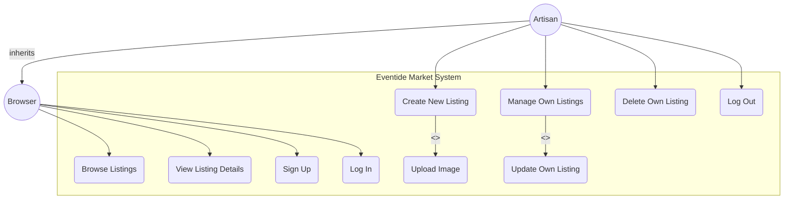
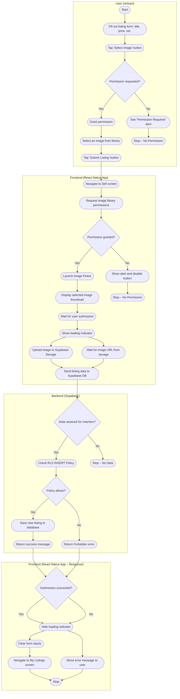

Of course. Here is a revised proposal with a simplified, 3-category rubric that totals 100 points.

-----

### **Final Team Project & Assessment: "Eventide Market"**

Welcome to your capstone project. For the final two weeks of this course, your team will build a complete, full-stack application. This project serves as your final assessment and is designed to be a cornerstone of your professional portfolio.

Your team's grade will be based on a 100-point scale, detailed in the simplified rubric below.

#### **Use Case Diagram**
This diagram illustrates the main actors and the actions they can perform within the "Eventide Market" system. It provides a high-level overview of the app's functionality from a user's perspective. The Artisan is a specialized type of Browser who inherits all Browse capabilities and gains additional ones upon authentication.

### **Activity Diagram: Create a New Listing**
This diagram details the step-by-step workflow when an authenticated Artisan creates a new listing. It shows the interaction between the user, the frontend application (React Native), and the backend services (Supabase), including decisions and parallel processes.

#### **1. Project Concept: The Artisan Exchange**

  * **Title:** Eventide Market
  * **Pitch:** A full-stack mobile marketplace where creators can sign up to showcase their handmade goods. Users can browse a vibrant market, view item details, and manage their own listings.
  * **Core Idea:** Your team will build a multi-user application featuring two primary roles:
      * **The Browser:** Any user can browse all items listed for sale.
      * **The Artisan:** An authenticated user who can create, manage, and delete their own listings.

#### **2. Marking Rubric (100 Points Total)**

Your project will be evaluated on three core categories.

| Category | Needs Improvement | Meets Expectations | Exceeds Expectations | Exceptional |
| :--- | :--- | :--- | :--- | :--- |
| **1. Core Functionality & Backend Integration** (50 pts) | (0-29 pts) Core features are non-functional. Users cannot sign in or view data. Database is not connected or RLS is missing entirely. | (30-39 pts) Most core features work but may have significant bugs. For example, auth works but image upload fails, or RLS policies are incorrect. | **(40-45 pts)** All core requirements are met. Auth, CRUD operations, and image uploads work reliably. RLS policies are correctly implemented for security. | **(46-50 pts)** All expectations are met flawlessly, *and* the team successfully implements a complex stretch goal that deeply integrates with the backend (e.g., User Profiles, Edit Functionality with UPDATE RLS). |
| **2. Technical Excellence & Code Quality** (30 pts) | (0-14 pts) Code is disorganized and hard to read. Components are not reused. The UI is static and breaks on different screen sizes. | (15-22 pts) Code is functional but messy. Some componentization is used, but the DRY principle is often violated. The app is usable on one screen size but is not adaptive. | **(23-27 pts)** Code is well-organized, readable, and follows the DRY principle through reusable components. The app is adaptive, using `SafeAreaView` and `useWindowDimensions` correctly. Loading and error states are handled. | **(28-30 pts)** All expectations are met with clean, elegant code, *and* the team implements advanced patterns like custom hooks for abstracting logic or advanced list UX (Pull-to-Refresh/Infinite Scroll). |
| **3. Project Demonstration & Documentation** (20 pts) | (0-9 pts) The demo fails or the team is unable to explain their work. The GitHub repository is missing or incomplete. | (10-14 pts) The demo is functional but unrehearsed. Team members are unclear on parts of the codebase. | **(15-18 pts)** The team presents a clear, rehearsed demo. All core features are showcased. The codebase is well-documented in a README.md file on GitHub. | **(19-20 pts)** The demo is polished and professional. The team confidently answers deep technical questions and provides clear, insightful documentation on their architectural decisions and challenges. |

-----

#### **3. Core Feature Checklist (To achieve "Exceeds Expectations" in each category)**

This checklist outlines the features required to earn a baseline score of 40/30/15 in the rubric categories.

  * **Authentication & Security:**
      * Functional Sign Up, Login, and Logout flow using Supabase Auth.
      * Protected routes for authenticated users using Expo Router and a Context-based check.
      * Correctly configured RLS policies in Supabase to ensure users can only modify their own data.
  * **Database & CRUD Operations:**
      * A `listings` table in Supabase with a clear schema (title, price, image\_url, etc.)
      * **(Create)** A form that allows authenticated users to add a new listing to the database.
      * **(Delete)** Functionality for a user to delete their *own* listings from the database.
  * **Device APIs & Storage:**
      * Use of `expo-image-picker` to select a photo from the device's library.
      * Successful upload of the selected image to Supabase Storage, saving the URL to the database.
  * **Code Quality & UI/UX:**
      * Application of the DRY principle by creating reusable components like `<Card>` and `<PrimaryButton>`.
      * Use of TypeScript for type-safe props and route parameters.
      * An adaptive UI that uses `<SafeAreaView>` and responds to different screen dimensions.
      * Clear loading (`ActivityIndicator`) and error states for all asynchronous operations.

#### **4. Stretch Goals (To achieve "Exceptional")**

Successfully implementing one or more of these features demonstrates mastery beyond the core curriculum.

  * **Edit Functionality:** Allow users to edit their own listings (requires an `UPDATE` RLS policy).
  * **User Profiles:** Create a public profile screen that displays all listings from a single user.
  * **Favorites System:** Use the React Context API to allow users to "favorite" items.
  * **Advanced List UX:** Implement Pull-to-Refresh or Infinite Scrolling on the market feed.
  * **Custom Hooks:** Abstract complex logic (like data fetching or permissions) into your own reusable hooks.

#### **5. Submission & Final Demonstration**

  * **Submission:** A link to your team's complete, well-documented GitHub repository. The `README.md` file should explain what the project is and how to run it.
  * **Demonstration:** A 15-minute team presentation including:
    1.  A live demo of the fully functional application.
    2.  A walkthrough of the core features and any stretch goals achieved.
    3.  A brief discussion of a key technical challenge your team overcame.

